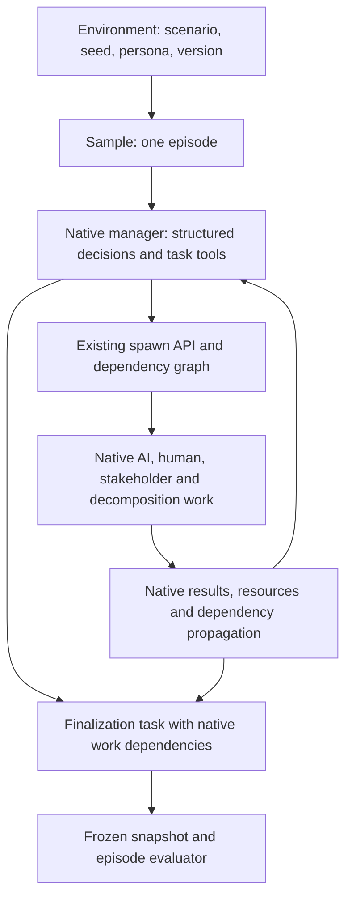
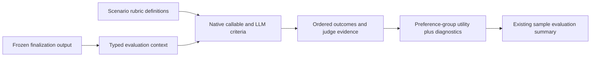

> **Historical design record, September 13 update:** Full implementation is authorized and underway. The [single implementation plan](../../../superpowers/plans/2026-09-07-manager-gym-native-port.md) now records actual files, core changes, native semantics and live acceptance gates. Earlier statements below about unimplemented code, approval gates, per-decision Tasks, alternative sandboxes or proposed mappings are historical and do not describe the current implementation.

---
status: active
opened: 2026-09-07
author: charlie + codex
architecture_refs:
  - docs/architecture/01_public_api.md
  - docs/architecture/02_runtime_lifecycle.md
  - docs/architecture/06_builtins.md
  - docs/architecture/08_rl_loop.md
  - docs/architecture/cross_cutting/sandbox_lifecycle.md
  - docs/architecture/cross_cutting/artifacts.md
supersedes: []
superseded_by: null
---

> **Superseded implementation guidance:** Use the [single MA-Gym implementation plan](../../../superpowers/plans/2026-09-07-manager-gym-native-port.md). This document is retained as historical product/design/source-audit context; its earlier proposals do not override the consolidated plan.

# Native Manager Agent Gym in Ergon

**Draft revised after the Ergon architecture audit and Charlie's scheduling decision, 2026-09-13.** The [PRD](prd.md) records Charlie's answers: evaluation first with a path to RL; native agents, messaging and rubrics; all 20 scenarios; normal Ergon data structures. This is a source audit and proposed design, with offline characterization runs. No runtime implementation or live model acceptance run has been performed.

The [Ergon-way audit](ergon-way-audit.md) explains the corrections to the earlier plan, including removal of mandatory no-sandbox support and the ordinary Python coordinator loop.

**Recommendation.** Implement MAG's simulation rules as benchmark code, and execute its manager, simulated workers, stakeholder work, and decomposition through Ergon's worker runtime. Use Ergon scheduling and ordinary result visibility for v1. The upstream engine remains an independent oracle for retained definitions and formulas; matching its scheduling is not a release gate. A sandbox containing the unchanged MAG engine does not deliver the requested native composition.

Read the [PRD feature manifest](prd.md#full-feature-manifest) for fidelity/change/defer decisions, the [capability and action mapping](capability-mapping.md) for individual gaps, and the [implementation plan](../../../superpowers/plans/2026-09-07-manager-gym-native-port.md) for the PR sequence and acceptance gates. The [scenario inventory and probe results](evidence/mag-inventory-and-probes.json) are reproducible with [the offline probe](evidence/probe_mag.py). The [row-level rubric inventory](evidence/rubric-inventory.csv) tracks all 1,281 composed definitions; its [generator](evidence/inventory_rubrics.py) ran offline on September 8.

## Evidence and scope

- MAG: [3f7a5d4af1d31abaedbedd525a0090452926fef4](https://github.com/DeepFlow-research/manager_agent_gym/tree/3f7a5d4af1d31abaedbedd525a0090452926fef4), GitHub `main` on the September 7 inspection, commit dated 2025-10-10.
- Ergon: local `agent/overnight-example-canaries` at `6910ecfc74807209b86db5c6f063ac9932b462a0`, dated 2026-07-16. At the September 7 inspection, GitHub's default branch resolved to this commit and local `origin/HEAD` pointed to `origin/dev`. GitHub `main` was older, at `b93d6d51c2fea01e9dc8b77d3ded57418d07f7d4`. This plan targets the current object-bound API, not the old `Benchmark` ABC on `main`.
- The workspace has pre-existing benchmark changes. They were read where relevant and left untouched. The September 3 [sandbox-driver draft](../2026-09-03-manager-agent-gym-environment.md) is also untouched. Its transport spike is historical evidence, not a native-composition proof, and was not rerun here.
- September 7 MAG offline run on Python 3.13.13 and its own lock: **67 passed, 3 skipped**, 2.20 seconds. This is not a claim that MAG and Ergon's dependencies co-resolve. The skipped tests call live models.
- September 7 probes characterize judge model forwarding, preference history, capacity, and the tools actually installed by the runner. An Ergon-venv PydanticAI probe found **6 iteration nodes for one tool call followed by a final answer**.

## The problem, measured

MAG is a benchmark of managing a changing team and workflow. Its scenarios are Python factories for tasks, teams, preferences, callable rules, and LLM rubrics. Loading rows is a small part of the port. Porting the policy interface, actor behavior and reward while documenting the accepted scheduling differences is the larger part.

| Inventory at the pinned revision | Measured value |
|---|---:|
| Registered scenarios | 20 |
| Scenario directories | 21; `tech_acquisition_integration` is not registered |
| Initial registry tasks across scenarios | 257 |
| Unique tasks including nested tasks | 694, range 14-58 per scenario |
| Atomic tasks | 541, range 10-44 per scenario |
| Scheduled team additions | 312, range 5-29 per scenario, excluding the separate stakeholder |
| Scenarios with removals | 7 |
| Scenarios with team/preference events at timestep >= 50 | 7 |
| Preference dimensions | 2-8 per scenario |
| Preference rubrics | 540 total, including 335 LLM rubrics |
| LLM rubrics selected by final evaluation, including workflow evaluators | 32-67 per scenario; median 41.5 |
| Default manager actions | 13 |
| Factory-selectable manager baselines | `cot`, `random`, `assign_all` |

These are constructed schema counts, not measured model calls or runtime cost. Retries and auxiliary model calls add work. The final evaluator count includes default evaluators, goal achievement, and scenario constraints, following `run_demo`. Judge configuration says `o3`, but the forwarding probe below shows the configured override is ignored.

The default 50-step horizon executes timesteps 0-49. Events at 50 and later do not occur in that run. Increasing the horizon changes the benchmark conditions and must change its recorded configuration.

## Composition model

MAG's `Workflow` mixes plans, composite work, resources, people and execution state. Ergon's `Task` is a bound executable invocation with a concrete Worker, Sandbox and evaluators; an `Environment` supplies runnable Samples.

For v1, one scenario episode is one Sample. Its manager uses the existing task API to assign native work, while Ergon owns readiness, dependency release and completion. Source plans and composite descriptions remain scenario/manager data, with a read-only projection for observations and rubrics. They do not form a second execution graph or scheduling queue.



The arrows show data/control relationships, not a cyclic task dependency graph. Repeated manager decisions need distinct captured records, but do not by themselves require one new Task per decision or a separate clock-coordinator worker. Use existing Worker execution and task tools; prove the required replay behavior before choosing any continuation structure.

Construct a Task when the selected Worker and its execution prerequisites can be bound. Pre-execution plan edits may change input data; once created, the native task is authoritative. Where source actions exceed existing cancel/refine/restart or dependency APIs, return an explicit unsupported action/state and document the restriction. Do not implement a shadow queue to preserve the source behavior. The proposed action restrictions remain implementation mapping decisions, separately identified from Charlie's accepted scheduler choice.

## State and execution ownership

| State | Authoritative owner | Persistence and visibility |
|---|---|---|
| Scenario, seed, horizon, persona, models, semantics version | Sample definition | Immutable provenance, including `scheduling_semantics=ergon_native_v1` and manager decision budget |
| Scenario inputs, plans, preferences and rubric projection | Benchmark data over native execution records | Unassigned descriptions remain data; statuses/results come from native tasks. No independent mutable execution graph |
| Human state and stakeholder policy | Benchmark formulas over native outputs; recorded policy state | Derive human inputs from completed work for the actor; record exact input attempt IDs and draws. Proposed event timing uses manager decision index |
| Actual task execution status and retries | Ergon runtime | Existing task graph, readiness, attempts, dependencies, result visibility and lifecycle |
| Agent identity across multiple invocations | Existing worker binding and actor read model | Propagate a stable configured actor key through existing fields, separately from code type and task ID |
| Artifacts, generations, tool events, model usage | Ergon runtime | Existing context/resource persistence, with logical-task linkage |
| Sent domain messages | Ergon communication storage | Extend worker-facing send/read access and recipient semantics; native actors use one shared message authority |
| Stakeholder messages not yet due | Benchmark scheduled outbox | Proposed delivery at manager decision indices; it never gates task results or dependency release |
| Evaluation result | Episode evaluator | Scalar reward and detailed evidence, with explicit incomplete/error status |

For v1, a manager process loss fails the episode and preserves available evidence; rerunning creates a new attempt. Do not promise transparent mid-episode resumption. A correct resume implementation must restore pending calls, consumed results, RNG state, mailbox delivery state, and recorded decision sequence together. Upstream's snapshot restorer is designed for re-evaluation and does not supply this contract.

### Assignment and propagation through existing APIs

At dispatch, bind the selected scenario person's configured Worker to `Task.worker`, bind a real `Sandbox`, then call the existing `WorkerContext.spawn_task(task, depends_on=...)`. The runtime already inserts the node/edges, persists the full configuration, memoizes worker-originated spawning and sends ready events. There is no new assignment registry, spawn API, queue or dispatcher in this design.

Use existing dependency edges when an actual invocation must follow another invocation's terminal completion. Use `get_task`/`subtasks`/`descendants` for status, resource APIs for work products and native cancel/refine/restart for execution lifecycle operations. Core owns propagation and sample finalization. Creating a dependency after its source already completed needs a characterization test: the current spawn path dispatches only dependency-free work immediately. Success-only dependencies also cannot substitute for timeout/failure-aware joins.

The earlier defense of benchmark-owned result admission is withdrawn for v1. Native A→B dependency release is the desired behavior even when source MAG would give the manager another action before admitting A's result. Task edits use native lifecycle restrictions; plan metadata cannot override them. See the [updated audit](ergon-way-audit.md#2-work-propagation-use-ergons-scheduler-for-v1).

### Replay and control flow

`_StepAwareTaskManagementService` memoizes spawn by parent ID and call index; ordinary worker code around it can replay. `retries=0` and no promised crash recovery do not remove this correctness requirement. Native manager decisions, model calls, state inputs, sampled draws and spawn call order must remain stable across normal replay.

The integration proof now exercises ordinary native fan-out/fan-in, result access and replay. The former MAG two-tick collection proof and shared collection deadline are withdrawn. Use dependencies for work ordering and a native finalization task for scoring after required work completes. Do not implement `SpawnedTaskHandle.wait` merely to recover source timing; it is currently unsupported and only merits work if a demonstrated native interaction needs it. Reuse current inspection/output/resource owners for any missing scoped result access.

Exercise actual step suspension/replay, ensuring no repeated model call or task mutation and no cached child handle attached to the wrong operation. Do not implement a plain mutation loop around memoized spawning or make database polling an execution scheduler.

### PostgreSQL-backed human state

Keep the human as an LLM simulator; calculate fatigue in code from completed native work. Reuse PostgreSQL task outputs, worker metadata and resources. At a human invocation's start, capture the exact eligible completed attempt IDs and reported hours for that actor in this episode, excluding duplicate delivery, superseded retries and other episodes. Freeze this input and sampled draws for replay. This snapshot records what the invocation observed; it does not withhold results from other tasks.

```text
fatigue = min(accumulated_simulated_hours * fatigue_rate, 0.5)
quality = clamp(gaussian(base_quality_mean, 0.1) - fatigue, 0, 1)
speed = max(0.1, gaussian(1.0, 0.2))
```

The LLM receives persona, task/resources and typed state. It does not get an unrestricted SQL tool or maintain counters. Preserve the auxiliary duration estimator, normal estimate × speed calculation, misunderstanding duration calculation and hourly labor cost separately from provider charges.

Concurrent invocations may observe different completed histories as native work finishes. Record those inputs; do not add actor serialization or a MAG collection/admission ledger to force identical fatigue exposure. This consequence of native scheduling is accepted. Counting misunderstood work in accumulated hours/count is a separate proposed correction because the source omits it. No workdays, recovery or fatigue-based speed penalty are added.

### Sandbox and artifact contract

Retain mandatory `Task.sandbox` and per-task runtime ownership. Start the integration proof with an existing compatible backend. Native model execution does not imply a sandbox-free Task: models already run through worker-side provider resolution while the bound sandbox supplies environment I/O and artifact lifetime.

Do not add `sandbox=None`, fake sandbox IDs, a shared live episode sandbox or custom cleanup. Each invocation follows provision → attach → worker → publish → evaluator → terminal cleanup. A cheaper simulation runtime can later implement `SandboxRuntime` if measurements justify it. It would need cross-process reattachment and a fix to the existing cleanup boundary, whose external fallback is currently E2B-specific. It is not an available drop-in backend today.

Each producing task publishes its work through `SampleResourcePublishService`/`SandboxResourcePublisher`; benchmark state references native resource IDs and the original producing attempt. Existing `publish_value` supports explicit text/JSON values, so a dedicated root artifact sandbox is not needed solely for state publication. Use the normal configured task sandbox and publisher first. Keep small typed control results in `WorkerOutput`; do not put a second document/blob transport inside its output string.

### Scheduling decision for v1

**Accepted by Charlie, September 13:** use Ergon's task scheduler for now. Task readiness, dependency release, propagation, completion and result visibility follow the existing runtime. Do not preserve MAG's collection phase, its 300-second collection wait, a separate admission barrier or a benchmark execution queue. Scheduler replacement may be revisited later; no replacement framework or compatibility mode is a v1 prerequisite.

This intentionally changes decision interleaving. When A completes, Ergon may release B and expose A's result before the manager's next action. Source MAG could place another manager decision before collection admitted A. Fatigue exposure, messages, final work and scores can therefore differ even with the same scenario and seed. Record `scheduling_semantics=ergon_native_v1`; do not claim scheduling or score equivalence to MAG.

**Proposed mapping for remaining scenario timing:** retain a monotonic manager decision index for team/preference events, stakeholder reply delays and the action budget. Apply due events before decision `t`; advance stakeholder rule/RNG processing once per decision, with replay-stable records. Queries, invalid actions and no-op count as decisions. This index is not a task clock: tasks continue and results become visible through the runtime without waiting for an index change. Detailed event ordering is a mapping proposal, not an additional decision already made by Charlie.

A default budget of 50 permits decisions 0–49; events scheduled later remain untriggered in that profile. Report decision index, simulated labor hours and actual wall time separately. Preserve duration/cost formulas as benchmark measures; reported simulated duration does not impose a task dispatch delay. A seed alone cannot make live completions or LLM output deterministic.

**Proposed end policy:** on the decision budget or worker end request, stop issuing manager decisions and let already-created work settle through native dependencies. Then run a native finalization task depending on the scored work, publish its immutable result and evaluate it. This drains work differently from source horizon termination and must appear in the version manifest. Native cancellation remains the path for an interrupted run; exhausted infrastructure failures make it incomplete. Do not score the manager's return while children are still running.

The proof must cover finalization dependencies created after their prerequisites already completed, as the current spawn path may miss earlier completion events. Fix that existing native readiness path if necessary; do not introduce a benchmark join scheduler. No task or message may alter the saved snapshot after finalization; evaluation uses the frozen result, never a query of moving state.

## Composition surface and minimal extensions

Use existing `Environment.from_records`, `Sample.from_tasks`, object-bound Task/Worker/Sandbox/Evaluator serialization and `WorkerContext.spawn_task(task, depends_on=...)`. Benchmark construction binds scenario actors, case parameters and evaluators explicitly. Helpers may construct these objects; they must not become a second configuration resolver or runtime registry.

The required worker roles remain manager, AI, human, stakeholder and decomposition. Roles alone do not justify separate execution-loop classes. Use existing worker factories when the behavior fits; share a structured-inference implementation where possible. A new algorithm is justified for the fresh, single-action manager boundary or human state/estimation workflow, not merely for another prompt/persona. Preserve original prompt/output contracts rather than silently substituting generic accumulating ReAct behavior.

| Concern | Existing owner | Narrow remaining work |
|---|---|---|
| Assignment/execution | `Task.worker`, dynamic spawn and full task snapshots | Bind the selected configured actor; no new scheduling registry |
| Stable actor identity | `assigned_worker_slug`, worker events, context binding keys and actor views | One resolver propagates stable configured identity separately from Worker type. First use Worker configuration/metadata; no new mandatory `Task.actor` object or actor table |
| Result access/join | Existing inspection, resources, task-output service and dependencies | Reuse native dependency composition and scoped full-result reads. Unsupported handle wait is not a MAG timing prerequisite |
| Replay | _StepAwareTaskManagementService and existing Inngest steps | Stable native decisions, input snapshots and spawn order; no raw loop with replay-sensitive side effects |
| Environment I/O | Task-bound `Sandbox` / `SandboxRuntime` | Use existing backend first; optimize only after measuring real sandbox overhead |
| Artifacts | Existing publisher, value publication and run-scoped resource reads | Bind access to actor/task context and link domain IDs to native resources |
| Messaging | CommunicationService, topics, sender/recipient fields and dashboard events | Scoped actor tools, visibility/filter/order guarantees and benchmark delayed delivery |
| Evaluation | Criteria, Evaluator aggregation and ordinary summaries | Source context/definitions, correct utility and incomplete-score policy |

The stable actor key must not replace the executable worker type. In particular, current actor reconstruction sets base-worker identity from the assignment key, and task preparation conflates those names in one resolver. Repair that existing path coherently rather than adding a parallel ActorBinding model. Keep role labels in ordinary metadata for evaluation; trainer integration remains later work.

Messaging derives the sender from runtime context, validates recipients within the sample and uses the existing topic/message storage. MAG owns the delayed outbox and domain end signal under the proposed decision-index/end mapping. Group topics exist, but do not automatically enforce private-message visibility. Avoid a new inbox database, event bus or message publisher.

Typed benchmark inputs/results carry logical task IDs, visible resources, persona, recorded state inputs, outcome, costs/hours and resource references. Private future preferences and rubric keys must stay out of the manager's input; current generic ReAct formatting can serialize the whole payload. A benchmark adapter enforces the public observation contract without changing global resource visibility for other benchmarks.

## Native rubric execution and evaluation contract

At final evaluation, preserve MAG's executed formula:

`utility = sum(preference_weight * sum(raw_rubric_scores) / sum(rubric_max_scores))`

The source uses weighted-by-maximum aggregation when rubric results exist, even when an evaluator advertises a different aggregation strategy. Zero/empty groups follow the reference's behavior. Goal achievement, constraints, communications, and efficiency remain separately inspectable diagnostics unless a new score version is approved.

Use one episode evaluator on the finalization task, after required native work completes. Represent every selected source rubric as a native `Criterion`, with a stable inventory ID, source group, maximum score and required context. Workflow diagnostics are criterion outcomes in the same saved evaluation, excluded from utility by the benchmark aggregator. No independently scored child evaluations are attached: Ergon averages scored evaluation rows across the sample, which would change headline utility.

The execution pipeline is:



1. `criteria_for(task)` reconstructs the selected definitions from the pinned scenario/configuration. The terminal profile follows the reference's actual selection predicates: 1,230 selected definitions across all scenarios, not all 1,281 declared definitions. Optional tick evaluations/forced checkpoints are outside v1; their declarations remain packaged.
2. Each criterion validates the same `EpisodeResult` from `CriterionContext.worker_result`, including the frozen native-workflow projection, decision index, effective preferences, manager actions and communication evidence. Source tick fields receive the documented decision-index mapping; preserving field shape does not imply source timing. Required optional fields are supplied only as the reference does. Generic task serialization must not reveal rubric prompts to the policy.
3. Callable criteria reuse extracted rule functions against the compatible domain snapshot. LLM criteria preserve prompt construction, output interpretation and score clamping, while using native model resolution/capture and honoring the configured judge model.
4. `CriterionOutcome` records raw score/max, normalized interpretation, group key, effective preference weight, snapshot hash, reasoning, model evidence and error. Ergon's `aggregate_task(task, results)` lacks criterion context; carry the frozen weight/snapshot identity in outcome metadata and validate consistency before aggregation rather than querying mutable state.
5. The benchmark evaluator computes source preference-group utility explicitly. Set result metadata `score_scale="normalized_0_1"`; the current summary mapper otherwise derives maximum score by summing criterion maxima. Store detailed preference contributions and diagnostic groups in existing summary metadata. Do not invent a new universal benchmark pass threshold from diagnostic booleans.

An independent numeric example: preference A has raw/max scores 1/1 and 0/3, with weight 0.6; preference B scores 1/1 with weight 0.4. Utility is `0.6 * (1/4) + 0.4 * 1 = 0.55`, not `0.70` from averaging normalized criteria within A. Adding any workflow diagnostic must leave 0.55 unchanged.

### Concurrency, errors and persistence gaps

MAG executes criteria concurrently with a default semaphore cap of 100. Ergon's current `EvaluationService.evaluate` awaits each criterion sequentially. Begin with the existing serial evaluator path. If measured judge latency warrants parallelism, add an opt-in concurrency limit there, defaulting to 1 for existing benchmarks. MAG sets an explicit recorded limit; capture provider constraints and measured runtime before choosing its operational default. All criteria see one immutable context. Preserve definition order in the returned list because the current summary mapper matches specs and outcomes by index. A bounded execution change in the existing service is the candidate optimization; validate shared context/runtime safety before enabling it. A separate judge scheduler is not required.

Ergon's evaluator retry boundary currently retries a whole evaluator. Preserve that visible contract initially, bound attempts, retain per-attempt usage/evidence, and never merge partial criteria from different snapshots or silently average duplicate evaluations. Per-criterion durable caching/resumption is deferred. Criterion errors must survive normalization; the aggregator marks a run incomplete if any required criterion exhausted its permitted retries. Valid zero scores remain valid outcomes.

There is a second error-as-zero gap in Ergon itself: `EvaluationService.persist_failure` currently inserts `score=0.0`, and sample aggregation includes it. Existing `SampleTaskEvaluation.score` is nullable and the aggregation already excludes `None`. Add an explicit incomplete-evaluation policy for this benchmark's evaluator, persisting a null score and error/status evidence through the existing failure path. Preserve compatibility for existing evaluator behavior, test CLI/UI readers with no valid score, and ensure `total_score` display fallbacks do not turn null back into a valid result. Do not merely catch the judge error inside benchmark code and return zero.

Use normal `sample_task_evaluations.summary_json` for criterion results and provenance, and ordinary resources for large snapshot/prompt artifacts. No separate MAG score table or dashboard is required. A re-evaluation consumes the exact frozen snapshot and creates a separately identified evaluation attempt linked to the original; it must not add a second scored row to the original sample's aggregate by accident. The first implementation can submit a separate evaluation sample referencing that snapshot.

## Path to RL, outside evaluation v1

Record the manager as `policy`; AI/human/stakeholder/decomposition as `environment`; judges remain evaluation records. Keep distinct manager decisions and all actor/model usage now. Current RL readers can filter by actor slug, but the trainer iterates all spans and attaches sample reward to each. Therefore v1 is **not RL-ready** merely because it has labels. A later RL plan must enforce policy-only selection, verify prompt/action/logprob alignment and attach the valid episode reward to manager decisions. Training execution, dense rewards, train/test split policy and optimization are not release gates for this port.

A native structured manager must preserve the upstream decision boundary and context construction. A generic accumulating ReAct conversation with 14 tools is a separate baseline: upstream CoT receives fresh observation-derived context and 13 action types, with dynamically constrained IDs. RandomV2 also calls an LLM; `assign_all` performs an LLM bulk mapping. Neither is the no-model smoke policy.

## Failure semantics

| Failure | Required behavior | Retry/score treatment |
|---|---|---|
| Unknown scenario, malformed configuration or unsupported model route | Reject before execution | Configuration error; no score |
| Invalid domain action | Record the failed action and consume one manager decision | No hidden extra policy decision; unsupported native lifecycle edits are explicit |
| Simulated misunderstanding or low-quality work | Commit a valid domain result | Judge normally; a human misunderstanding can report domain success |
| Model refusal or exhausted inference retries | Record cause and invocation role | Reference oracle preserves upstream result; corrected runs fail or mark evaluation incomplete as appropriate |
| Native execution deadline | Keep invocation ID and actual status; use existing failure/cancellation paths | No collection timer or implicit respawn |
| Parent cancellation or crash | Use existing descendant cancellation/lifecycle; retain evidence | Incomplete attempt, not utility zero |
| Judge outage or malformed judge output | Mark evaluation incomplete | No valid training reward; do not silently ingest upstream error-as-zero behavior |
| Manager decision budget reached | Proposed: stop decisions, drain created native tasks, finalize remaining work state | Valid when required native work settles successfully; explicit deviation from source horizon timing |
| Duplicate action/result delivery | Deduplicate by episode, invocation/action ID and sequence | One application only; divergent duplicate is an invariant error |
| Missing terminal snapshot or contradictory state | Fail loudly | No synthetic successful finalization |

The finalization task publishes the final state before returning successful `WorkerOutput`; its native dependencies ensure the required work has completed. Evaluators read a completed result; they do not drive the simulator. Ergon skips evaluators after worker failure and persists outputs before evaluators run, so moving normal finalization into a criterion is incorrect.

## Benchmark fixes and parity

Native scheduling is an accepted semantic change, including ordinary result visibility. The event-index and end-policy mappings above are proposed details. Compare retained formulas and definitions against the oracle; exact source scheduling is not a release gate. Other corrections below remain separate proposals.

Keep one frozen upstream reference in the test harness. Choose an explicit corrected native benchmark version for intentional fixes, and store the exact correction list. Avoid permanent runtime feature flags for every upstream bug.

Source and offline evidence makes the following decisions necessary:

1. **Preference schedule.** A 0.5/0.5 distribution at tick 0 becomes 0.9/0.1 at tick 0 merely by scheduling a 0.9/0.1 update at tick 10. Recommend immutable timeline snapshots in the native version; preserve the behavior in the reference oracle.
2. **Judge model.** A rubric configured with `sentinel-model` invokes a rule configured with `o3`. Recommend forwarding the configured judge model; record this as a correction and validate actual invocation metadata.
3. **Capacity.** One worker with `max_concurrent_tasks=1` starts two tasks in one tick. Recommend no new capacity restriction during the initial transition port. If capacity enforcement is desired, add it as a separately versioned benchmark rule after specifying assignment rejection and queue semantics.
4. **Tools.** Runner-created ICAAP agents receive communication tools, including duplicate names, rather than the default search/analysis tool bundle. Recommend preserving reachable capabilities initially, deduplicating equivalent tools only after tracing dispatch behavior. Adding real web search, code execution, or fatigue-changing breaks would change the benchmark.
5. **Termination/action set.** The default CoT action set omits `request_end_workflow`. Worker communication tools can still request termination. Preserve the manager's 13 actions; an extra manager stop action is a distinct policy interface version.

6. **Randomness.** Human noise uses module-global `random`, while its inherited `configure_seed` only stores a seed field. A matching seed alone does not establish deterministic replay. Record/inject sampled draws for conformance; adopt explicit per-actor RNG streams only as a documented native correction. Live model outputs remain nondeterministic.

7. **Human accounting.** The misunderstanding branch reports duration/cost but does not increase actor hours/count. Recommend counting completed misunderstood work as a separate correction. Native completion-based state inputs already follow the accepted scheduler direction; record their exact attempt set and fixed draws for formula tests.
8. **Evaluation scheduling.** Source preference selection does not expand `BOTH`; workflow rubric selection ignores declared cadence whenever a cadence is supplied. The catalog contains no `BOTH` rubrics. Preserve ordinary final selection for v1; do not silently repair optional scheduling while claiming reference equivalence.
9. **Failure validity.** Both source MAG judge handling and current Ergon evaluation persistence can represent infrastructure errors as zero scores. Native corrected runs must distinguish incomplete evaluation from valid zero performance.

The [mapping document](capability-mapping.md) includes experiment, expected behavior, observed behavior, implication, and proposed handling for each material finding.

## Decisions and review checkpoints

**Settled by the request:** evaluation first with a path to RL; native actors/messages/rubrics; all 20 registered scenarios; full fidelity/change manifest; ordinary Ergon benchmark data and inspection; Ergon task scheduling and normal result visibility for v1. The PRD and technical design are drafts; no runtime implementation has started.

**Decision record and remaining proposals:**

| Decision | Options and tradeoff | Recommendation |
|---|---|---|
| World/execution composition | Ergon owns the sole execution graph; scenario plans remain input data | Accepted scheduler direction. No MAG collection barrier, admission ledger or independent dispatch state |
| Reference fidelity | Preserve every upstream quirk in production; or correct identified bugs with explicit version provenance | Frozen oracle plus one documented native version; decide each correction before score comparisons. |
| Initial scale | All scenarios at once; or smallest real scenario then feature-rich cases | Start with `legal_litigation_ediscovery`, then ICAAP and `marketing_campaign`. Full inventory still ships before declaring complete support. |
| Sandbox execution | Existing per-task Sandbox; new lightweight runtime; optional Task sandbox | Existing per-task contract first. Withdraw the no-sandbox prerequisite; measure before adding a runtime adapter. |
| Manager policy | Generic ReAct; or faithful structured single-decision policy | Structured baseline first; ReAct as a named additional baseline later. |
| Recovery | Full resumable actor runtime now; or truthful failure and whole-episode rerun | Fail incomplete episodes in v1. Durable resume is deferred until workload evidence justifies it. |
| Human state | Projection of completed native outputs at invocation start | Record eligible attempt IDs and draws through existing output/resource paths; no admission ledger |
| Clock | Scenario event index; task scheduling remains native | Proposed: event timing and action budget use manager decision index; normal result visibility and drain-then-finalize end policy |
| Rubric execution | Flat aggregate; custom external engine; or native criteria plus benchmark aggregation | Native criteria and exact grouping; existing serial execution first, explicit incomplete status, concurrency only if measured |
| Train/test split | Named evaluation suites now; scenario-family or seed splits for later training | Record suites/seeds now; defer training split policy and do not invent an upstream official split |
| Merge base | Older `main`; or current object-bound default `dev` lineage | Target the inspected default lineage; confirm repository PR policy at implementation kickoff. |

**Owners and gates:** Charlie owns product scope and benchmark-version decisions; the implementation owner is not yet assigned. No delivery date was supplied. Core changes are justified by the first composition proof, which must establish replay, result visibility, sandbox lifetime, actor identity and normal propagation before expanding APIs. Set dates from staffing and measured integration results. The correction list and optional tick-evaluation deferral are prepared for review; they are not presented as decisions Charlie already made.

## On acceptance

Reconcile the September 3 draft into this native direction rather than implementing both designs. Keep the upstream engine in the development characterization harness only. Update the public API, runtime lifecycle, builtins, RL, artifact, and sandbox architecture docs in each relevant feature PR. Retain existing benchmark behavior through regression gates. The final port must not carry a second production scheduler copied from MAG alongside Ergon scheduling.
