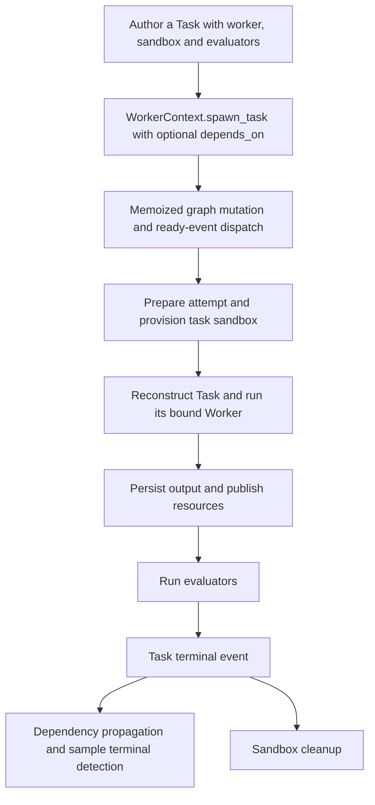

> **Historical design record, September 13 update:** Full implementation is authorized and underway. The [single implementation plan](../../../superpowers/plans/2026-09-07-manager-gym-native-port.md) now records actual files, core changes, native semantics and live acceptance gates. Earlier statements below about unimplemented code, approval gates, per-decision Tasks, alternative sandboxes or proposed mappings are historical and do not describe the current implementation.

> **Superseded implementation guidance:** Use the [single MA-Gym implementation plan](../../../superpowers/plans/2026-09-07-manager-gym-native-port.md). This document is retained as historical product/design/source-audit context; its earlier proposals do not override the consolidated plan.

# Audit: where the MAG plan departed from Ergon

**Reviewed 2026-09-13.** This audits the September 8 plan against the current local Ergon checkout, still at `6910ecfc74807209b86db5c6f063ac9932b462a0`. No runtime code changed. The revised [RFC](README.md) and [implementation plan](../../../superpowers/plans/2026-09-07-manager-gym-native-port.md) incorporate these corrections.

The earlier plan correctly used native workers and the existing spawn API, but made optional sandboxes a prerequisite, underspecified propagation/replay, and proposed several general APIs before exhausting existing services. The biggest correctness omission was treating the coordinator as an ordinary long-running Python loop even though worker-side spawning uses durable steps and replays the function.

**Subsequent decision, September 13:** Charlie chose Ergon scheduling for v1. The audit's initial defense of MAG-owned planned execution and result admission is withdrawn. Source timing differences remain documented, but are accepted rather than reasons to build a benchmark scheduler. Event-index and end-policy details in the [RFC](README.md#scheduling-decision-for-v1) remain proposals.

## What Ergon already owns



Actual execution comes from the serialized `Task.worker` object, not a benchmark-maintained slug-to-worker scheduler. Parent links express containment; dependency edges express ordering. Neither implies MAG's mutable planned-work semantics. Source references below distinguish existing public APIs from internal services that may need a small facade.

## Findings and disposition

| Area | Earlier proposal | Verdict and correction |
|---|---|---|
| Spawning | Coordinator invokes `context.spawn_task`; surrounding prose describes new orchestration work | The call was already correct. Explicitly reuse its graph insertion, dependency edges, dispatch and replay wrapper. Do not add a second spawning API or dispatcher. |
| Assignment | Scenario role templates plus a proposed `Task.actor` binding | Bind the chosen person's complete configured Worker to `Task.worker` at dispatch. Keep scenario person identity separate from code type. Reuse existing binding-key/event fields; a new general ActorBinding object is not justified yet. |
| Dependencies | Benchmark scheduler owns readiness | Withdrawn for v1. Ergon dependencies, readiness, completion and result visibility are authoritative, accepting the source timing differences |
| Waiting | Add WorkerContext.wait_for_task and ordinary polling | No MAG collection wait is required. Use native dependencies; extend existing handle/result owners only for a demonstrated native interaction need |
| Coordinator | A plain while loop mutates state between spawns | Remove the separate clock coordinator. Native manager control still needs stable decisions, model calls and spawn order across runtime replay |
| Sandboxes | Make `Task.sandbox` optional; zero child sandboxes; one root artifact sandbox | Unnecessary breaking prerequisite. Keep the mandatory per-task Sandbox and existing lifecycle. Start with an existing backend. A cheaper runtime is a separate adapter/performance proposal, not equivalent to removing the abstraction. |
| Resources | Typed resources embedded in worker result and one coordinator publishes them | Too easy to recreate the removed artifact bag or lose producer attribution. Publish each producing task's resources through existing publisher/service paths; pass resource IDs and small typed control data. |
| State persistence | New public annotation journal and event-key discipline | Reuse native outputs/resources and record only scenario facts, input attempt IDs and sampled actor effects; no admission ledger or second execution graph |
| Messaging | Generic actor send/read API, new recipient and cursor contracts | Storage, group topics, message fields and dashboard events already exist. Add a context-bound facade/tools and only missing MAG visibility/delivery semantics. Do not create another message bus. |
| Agents | One implementation module per role | Roles do not automatically need distinct Worker algorithms. Reuse factories/common structured inference where behavior matches. Human simulation and single-action manager control may justify new algorithms; persona alone does not. |
| Evaluation | Native criteria, custom utility, new concurrency policy | Native criteria and custom aggregation are justified. Serial execution already works; criterion concurrency is a measured optimization, not a first-slice prerequisite. Incomplete-versus-zero scoring remains a real integrity gap. |

## 1. Spawn and assignment: reuse the object-bound path

[`WorkerContext.spawn_task`](../../../../ergon_core/ergon_core/api/worker/context.py:129) already takes a complete `Task` and `depends_on` IDs. [`spawn_dynamic_task`](../../../../ergon_core/ergon_core/core/application/runtime/task_management.py:112) inserts a dynamic node with full task JSON, parent identity and dependency edges, then dispatches dependency-free work after commit. This does not need reimplementation.

The benchmark's dispatch decision should produce the existing shape:

```python
# Existing API shape; helpers only construct benchmark-specific data.
child = Task(
    task_slug=invocation_slug,
    instance_key=episode_key,
    description=public_work_description,
    task_payload=work_input,
    worker=scenario_actors[assigned_person_id],
    sandbox=work_sandbox_definition,
    evaluators=(),
)
handle = await context.spawn_task(child, depends_on=execution_dependencies)
```

MAG permits assignment and later edits before readiness. For v1, source descriptions can remain unbound input data; executable assignment uses the existing spawn API when Worker and prerequisites can be bound. Proposed restrictions for unresolved dependencies and edits after creation are explicit in the action map. Do not retain a benchmark queue to emulate the old behavior. After creation, changing `assigned_worker_slug` does not reassign execution: the runtime reconstructs the serialized Task. Native `refine_task` rejects running tasks, and the port must respect that restriction.

There is a real identity defect: dynamic spawn currently sets `assigned_worker_slug=task.worker.type_slug`, and actor reconstruction uses that as both actor and base-worker identity. Two human configurations of one Worker class can collapse. Fix the binding-key flow using existing graph/context/worker-event fields, with one canonical resolver and a stable configured key. Start with the existing Worker metadata/configuration seam; do not create another actor registry or use class names as person IDs. Keep worker type, actor key and task-attempt ID distinct, including `_resolve_sample_worker_config`, which currently conflates type and assignment on part of the path. [Actor read model](../../../../ergon_core/ergon_core/core/views/rl/actor_state.py:66), [worker resolution](../../../../ergon_core/ergon_core/core/application/runtime/task_execution.py:269).

## 2. Work propagation: use Ergon's scheduler for v1

[`on_task_completed_or_failed`](../../../../ergon_core/ergon_core/core/application/runtime/lifecycle.py:243) already satisfies/invalidates outgoing edges, releases eligible work and blocks successors on failure. [`WorkflowService.propagate`](../../../../ergon_core/ergon_core/core/application/runtime/sample_lifecycle.py:244) performs sample terminal checks; task jobs emit the resulting ready/terminal events. `cancel_task`, `refine_task` and `restart_task` already own lifecycle changes and downstream invalidation.

The benchmark must not reproduce those services. Nor should it suppress native failures to make the sample look successful: a model/transport failure remains native failure; a simulated human misunderstanding is a successfully executed simulation result containing a domain outcome.

The source difference remains real: MAG can give the manager its next action before collection admits A's result, whereas native propagation can release B immediately after A completes. Charlie has accepted that difference for v1. Use the native A→B edge and ordinary result visibility. Remove the collection barrier, benchmark readiness/completion graph and admission ledger. Unassigned descriptions and composite annotations remain input data/read-only projections, without authority over native task status.

A late dependency needs characterization: `spawn_dynamic_task` dispatches only when `depends_on` is empty, so adding a dependency on an already completed source may miss the source's earlier propagation event. Do not assume creating that edge immediately releases work. The finalization task must be released through the existing runtime, including when its prerequisites completed before its creation. A narrow fix belongs in that native path; source collection-timeout support is not needed.

Native failure semantics also constrain recovery: the current sample terminal check fails a settled sample containing any failed node. Retrying a failed logical job as a *new* node does not erase the old failure. V1 therefore fails an episode on exhausted infrastructure failure; do not introduce a benchmark-local recovery scheduler that claims otherwise. A later recovery policy must use and test native restart/failure semantics.

## 3. Replay is not optional crash recovery

[`_StepAwareTaskManagementService`](../../../../ergon_core/ergon_core/core/jobs/task/worker_execute/job.py:220) already memoizes spawn operations using parent task ID plus call index. Its event dispatch can suspend and replay the worker function. `retries=0` does not disable this normal execution behavior.

The earlier sketch loaded/mutated world state, spawned, waited and advanced a Python loop. If replay reloads the newest world state, skips earlier phases, resamples noise, or changes spawn order, the same call index can refer to a different logical operation. A new SQL dedup key for results does not fix that mismatch.

The revised gate proves native task composition and manager replay, not the source two-tick sequence. Keep model responses, input snapshots, draws and spawn call order stable across step suspension. Use dependencies for actual work ordering and finalization; add only demonstrated missing access/checkpoint behavior through existing owners. No MAG collection wait or new Inngest engine is justified.

`SpawnedTaskHandle.wait()` currently raises [`AwaitCompletionNotSupportedError`](../../../../ergon_core/ergon_core/api/worker/results.py:14). [`get_task`](../../../../ergon_core/ergon_core/api/worker/context.py:222) supplies status but its output is truncated to 512 characters by [TaskInspectionService](../../../../ergon_core/ergon_core/core/application/runtime/task_inspection.py:22). Large work products already have [`resources`/`read_resource`](../../../../ergon_core/ergon_core/api/worker/context.py:233); small complete control outputs can be read through the existing task-output service behind a scoped facade. Unsupported wait remains a current API limitation, not a v1 prerequisite by itself. Missing spawning is not a gap.

## 4. Sandbox versus sandbox backend

[`Sandbox`](../../../../ergon_core/ergon_core/api/sandbox/sandbox.py:48) owns serializable configuration and delegates I/O to [`SandboxRuntime`](../../../../ergon_core/ergon_core/api/sandbox/runtime.py:26). The task runtime provisions it, workers and evaluators reconnect, resources are published, and terminal-event cleanup releases it. None of that requires the LLM itself to run inside the sandbox.

My proposed `Task.sandbox=None` changed authoring, serialization, worker context, output publishing, evaluation and cleanup simply because MAG's inference does not need a shell. That is too broad for this port. Keep an actual task-bound sandbox and normal producer/evaluator lifetime. Do not share one live sandbox across every child, fake IDs or promote the in-process test stub into production.

A lightweight runtime using PostgreSQL-backed simulation state and durable artifact I/O could fit the existing abstraction, if cost warrants it. It would still need a real identity, cross-process reattachment, isolation, honest unsupported-command behavior and cleanup. It is not already implemented. In fact, current [cleanup](../../../../ergon_core/ergon_core/core/infrastructure/sandbox/lifecycle.py:32) falls through to [`BaseSandboxManager.terminate_by_sandbox_id`](../../../../ergon_core/ergon_core/core/infrastructure/sandbox/manager.py:519), whose external fallback is E2B-specific. A non-E2B runtime would need that existing lifecycle boundary generalized and tested, not an extra benchmark cleanup path. Use the existing E2B-backed path for the first integration proof and measure the overhead.

## 5. Resources, PostgreSQL state and messages

[`SampleResourcePublishService`](../../../../ergon_core/ergon_core/core/application/resources/publishing.py:21) already owns publishing/deduplication, with sandbox-file publishing and `publish_value` for explicit text/JSON values. The standard persist-outputs job uses it. I missed that value-publishing path when framing one root artifact sandbox as necessary.

Preserve each resource's native producing attempt. Each child writes/publishes its own work; benchmark records reference those IDs. Small typed status, hours, cost and observed-input metadata can use normal worker outputs. A complete simulated document graph should not become an opaque `WorkerOutput.output` string used as a replacement resource system.

Human fatigue requires actor identity, reported simulated hours and the exact completed native attempts observed when the invocation starts. Derive typed state from existing outputs; capture its inputs and draws for replay. Exclude duplicate deliveries, superseded retries and other episodes. Use normal resources/metadata for this evidence, without an admission ledger or independent runtime history. Concurrent starts may see different completed work under native scheduling; that timing difference is accepted.

[`CommunicationService.save_message`](../../../../ergon_core/ergon_core/core/application/communication/service.py:30) already stores sender, recipient, topic, content and producing attempt, and publishes dashboard events. Threads are already keyed by `(sample_id, topic)`, supporting shared topics. The missing layer is a context-bound actor interface with recipient visibility, stable read ordering and MAG's delayed outbox/control semantics. Shared topic membership does not automatically enforce private-message access. Reuse storage and publication; test concurrent message ordering and authorization instead of building another mailbox database.

## 6. What remains worth implementing

| Work | Why it survives the audit |
|---|---|
| Scenario loader, actor rules and rubric projection | Retain benchmark definitions and formulas. Proposed decision-index events never gate native dispatch or result visibility |
| Faithful single-action manager and human simulation | Existing ReAct uses a fixed output contract; human noise/estimation/state introduce actual control-flow differences |
| Shared structured inference for suitable AI/stakeholder/decomposition roles | Avoid duplicate worker loops/SDK capture; separate roles need not mean separate algorithms |
| Stable configured actor identity propagated through existing bindings | Same-class humans must remain distinct across invocations; current class-derived identity is insufficient |
| Native replay and finalization proof; scoped result access where missing | Use existing steps/dependencies and fix demonstrated native gaps; do not add a wait or collection API for source timing |
| Actor-scoped tools over communication/resource services | Infrastructure exists, curated worker access and benchmark visibility do not fully exist |
| Native criteria and exact preference aggregation | Normal Rubric's flat weighting does not reproduce MAG's grouped utility |
| Explicit incomplete-evaluation status | Current native persistence can record evaluator failure as zero; that corrupts evaluation comparisons |

Scheduler replacement, criterion concurrency, sandbox cost optimization, a new actor abstraction and RL execution are not first-slice prerequisites. No new task assignment service, scheduler, dependency propagation engine, message database, blob store or sample-finalization path is justified.

## Evidence and limitations

On September 13, ran four existing core unit tests through `ergon test core unit`: dependency-free spawn dispatch, dependency-held spawn, step-aware spawn replay returning one handle/node/event, and the unsupported wait contract. **4 passed, 566 deselected.** The initial run hit an unwritable uv cache; the successful run used a temporary writable cache and the installed environment.

This is a source-backed architectural audit with targeted existing tests. It is not a live MAG replay test, deployed propagation test, or proof of a new sandbox runtime. Some architecture prose still describes retired Benchmark/WorkerSpec APIs and older cleanup timing; current object-bound code and tests determine the actual path above. The corrected implementation plan requires those cross-process proofs before expanding core.
