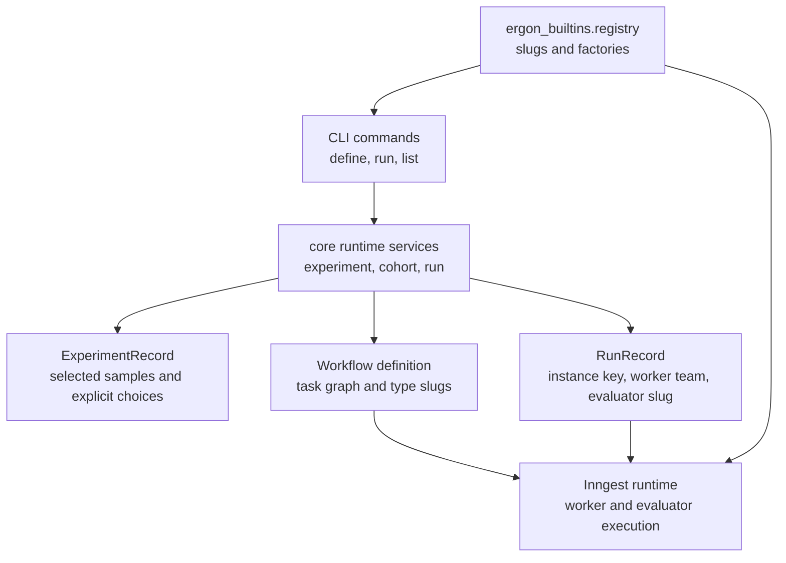

# Ergon Built-ins Rebuild Structure

This document lays out the target shape for `ergon_builtins` after the Ergon core public API cleanup. It assumes the core authoring API from `2026-04-28-public-api-target-structure.md`:

- `Benchmark`, `Task`, `BenchmarkRequirements`
- `Worker`, `WorkerContext`, `WorkerOutput`
- `Criterion`, `CriterionContext`, `CriterionOutcome`, `ScoreScale`
- `Rubric`, `TaskEvaluationResult`
- advanced `Evaluator` only when a fixed `Rubric` is not expressive enough

The key design rule is that built-ins should be normal public API consumers. The CLI and runtime should discover built-ins through typed registries and service facades, not by importing benchmark internals or rebuilding object graphs by hand.

## Goals

- Keep benchmark authoring code small, public-API-first, and easy to copy for external benchmark authors.
- Keep sandbox, dataset loading, and optional dependency code inside benchmark-owned packages.
- Keep the registry as the stable integration boundary for CLI discovery, experiment definition, run launch, and Inngest execution.
- Keep benchmark slugs separate from runtime choices: the CLI must pass worker, evaluator, sandbox, model, and extras/dependency intent explicitly for now.
- Avoid compatibility aliases for renamed public concepts during the coordinated rebuild.

## Runtime Integration Model



The CLI path should be slug-driven:

1. Validate the explicit `benchmark_slug`, `worker_slug`, `evaluator_slug`, and `sandbox_slug` against `ergon_builtins.registry`.
2. Ask a core service facade to define or launch the experiment.
3. Persist only durable identifiers and slugs in `ExperimentRecord`, workflow definitions, and `RunRecord`.
4. Rehydrate live workers, criteria, rubrics, and sandbox managers from registries at runtime.

## Proposed Package Tree

```text
ergon_builtins/
   ergon_builtins/
      __init__.py

      registry.py
         # merged public discovery surface
         # imports registry_core and optional registries

      registry_core.py
         # always-importable built-ins with no [data] dependency
         # exports BENCHMARKS, WORKERS, EVALUATORS, SANDBOX_MANAGERS,
         # SANDBOX_TEMPLATES, MODEL_BACKENDS

      registry_data.py
         # HuggingFace/pandas/datasets-dependent built-ins
         # same export names as registry_core

      registry_local_models.py
         # optional local model backends

      shared/
         __init__.py
         criteria/
            code_check.py
            file_check.py
            llm_judge.py
            sandbox_file_check.py
         workers/
            react_worker.py
            training_stub_worker.py
            react_prompts.py
         models/
            cloud_passthrough.py
            openrouter_backend.py
            openrouter_responses_backend.py
            resolution.py
            vllm_backend.py
         tools/
            # reusable public worker tools only
         observability/
            # event/transcript adapters used by shared workers

      benchmarks/
         minif2f/
            __init__.py
            benchmark.py
            task_schemas.py
            worker_factory.py
            prompts.py
            toolkit.py
            criteria.py
            rubric.py
            sandbox_manager.py
            sandbox/

         swebench_verified/
            __init__.py
            benchmark.py
            task_schemas.py
            worker_factory.py
            prompts.py
            toolkit.py
            criterion.py
            rubric.py
            sandbox_manager.py
            sandbox_manager_support.py
            sandbox/

         gdpeval/
            __init__.py
            benchmark.py
            task_schemas.py
            loader.py
            worker_factory.py
            criteria.py
            rubric.py
            sandbox.py

         researchrubrics/
            __init__.py
            benchmark.py
            vanilla.py
            task_schemas.py
            worker_factory.py
            researcher_worker.py
            workflow_cli_react_worker.py
            criteria.py
            judge_criterion.py
            rubric.py
            sandbox_manager.py
```

### Package Boundary Rules

- Benchmark packages own their task payload schemas, dataset loaders, sandbox/toolkit wiring, benchmark-specific criteria, and default rubric.
- `shared/` contains reusable primitives that do not know about one benchmark's payload schema.
- Registered worker factories live next to the benchmark when they bind benchmark-specific tools or sandbox setup.
- Generic worker classes live in `shared/workers/`; benchmark packages wrap them with factories.
- Optional data dependencies stay in `registry_data.py` and data-only benchmark packages. Importing `registry_core.py` must not require `datasets`, pandas, `swebench`, or HuggingFace extras.
- CLI code should import only `ergon_builtins.registry` and core service facades.

## Registry Contract

The registry should continue to expose dictionaries keyed by stable slugs:

```python
BENCHMARKS: dict[str, type[Benchmark]]
WORKERS: dict[str, WorkerFactory]
EVALUATORS: dict[str, type[Evaluator]]
SANDBOX_MANAGERS: dict[str, type[BaseSandboxManager]]
SANDBOX_TEMPLATES: dict[str, Path]
MODEL_BACKENDS: dict[str, Callable[..., ResolvedModel]]
```

`WorkerFactory` should remain a callable shape that the runtime can use after sandbox setup:

```python
WorkerFactory = Callable[..., Worker]
```

Every registered worker factory must accept:

```text
name: str
model: str | None
task_id: UUID
sandbox_id: str
```

The registry should not provide benchmark-level default profiles in this phase. Explicit beats implicit while the package structure is still moving: callers must specify the worker, evaluator, sandbox, model, and dependency extras they intend to use.

This gives the CLI enough information to validate explicit requests for:

- `ergon benchmark list`
- `ergon worker list`
- `ergon evaluator list`
- `ergon experiment define <benchmark>`
- `ergon experiment run <experiment-id>`
- `ergon benchmark run <benchmark>`
- onboarding/setup messages for explicitly requested extras, E2B, HuggingFace, or API keys

## Public API Usage Rules

Built-ins should use root imports for ordinary authoring:

```python
from ergon_core.api import Benchmark, BenchmarkRequirements, Task
from ergon_core.api import Worker, WorkerContext, WorkerOutput
from ergon_core.api import Criterion, CriterionContext, CriterionOutcome
from ergon_core.api import Rubric, TaskEvaluationResult
```

Use advanced imports only where the benchmark needs dynamic criteria:

```python
from ergon_core.api.rubric import Evaluator
```

Core composition types stay out of benchmark authoring files:

- no `Experiment` imports in benchmark packages
- no `WorkerSpec` imports in benchmark packages
- no run/cohort/definition handles in benchmark packages
- no direct DB/session imports in workers, criteria, or rubrics

## Benchmark Implementation Pattern

Each benchmark package should follow the same high-level shape:

```text
benchmark.py
   Benchmark subclass
   type_slug
   task_payload_model
   onboarding_deps / BenchmarkRequirements
   build_instances() -> Mapping[str, Sequence[Task[Payload]]]
   evaluator_requirements()

task_schemas.py
   Pydantic payload models
   dataset row conversion helpers when lightweight

worker_factory.py
   factories that bind shared workers to benchmark-specific tools/sandboxes

criteria.py / criterion.py
   benchmark-specific Criterion implementations and builders

rubric.py
   Rubric or Evaluator subclass registered under a stable evaluator slug

sandbox_manager.py / sandbox.py
   benchmark-specific sandbox lifecycle and setup
```

`Task` construction should consistently set:

- `task_slug`: stable dataset sample identifier
- `instance_key`: selected instance key used by experiment/run services
- `description`: worker-facing problem statement
- `evaluator_binding_keys`: usually `("default",)` unless the benchmark has multiple evaluator bindings
- `task_payload`: typed payload model containing all evaluator-only ground truth

## MiniF2F

### Folder

```text
benchmarks/minif2f/
   benchmark.py
   task_schemas.py
   worker_factory.py
   prompts.py
   toolkit.py
   criteria.py
   rubric.py
   sandbox_manager.py
   sandbox/
```

### Benchmark

`MiniF2FBenchmark` should remain a public `Benchmark` implementation:

- `type_slug = "minif2f"`
- `task_payload_model = MiniF2FTaskPayload`
- `onboarding_deps = BenchmarkRequirements(e2b=True)`
- `build_instances()` downloads or reads MiniF2F-v2c and returns one `Task` per theorem.
- `description` should include the informal statement, Lean header, and formal theorem.

The payload should carry:

- `name`
- `informal_statement`
- `formal_statement`
- `header`

Ground truth proof, if available later, belongs in the payload or metadata for evaluation only, not in the worker prompt.

### Worker

The recommended first worker pairing is `minif2f-react`, implemented as a benchmark-owned factory around the shared ReAct worker:

- resolve the live sandbox by `task_id`
- build `MiniF2FToolkit`
- bind Lean tools such as write file, check file, and verify proof
- pass a MiniF2F-specific system prompt
- return a `WorkerOutput` whose final answer includes the proof file path or proof text

The factory belongs in `benchmarks/minif2f/worker_factory.py` because it knows about Lean, the sandbox manager, and the MiniF2F toolkit.

### Criteria And Rubric

`ProofVerificationCriterion` should use `CriterionContext` public capabilities rather than importing a concrete runtime protocol from public files.

`MiniF2FRubric` should be a fixed `Rubric` with one proof-verification criterion:

- score `1.0` when Lean verifies the final proof
- score partial credit for syntactically valid but incomplete proof attempts
- score `0.0` for missing or invalid proof artifacts
- return `TaskEvaluationResult` with normalized score and proof metadata

### Required CLI Pairing

```text
benchmark_slug: minif2f
worker_slug: minif2f-react
evaluator_slug: minif2f-rubric
sandbox_slug: minif2f
extras: none
model: explicit CLI value, e.g. openai:gpt-4o
```

## SWE-Bench Verified

### Folder

```text
benchmarks/swebench_verified/
   benchmark.py
   task_schemas.py
   worker_factory.py
   prompts.py
   toolkit.py
   criterion.py
   rubric.py
   sandbox_manager.py
   sandbox_manager_support.py
   sandbox/
```

### Benchmark

`SweBenchVerifiedBenchmark` should remain the benchmark loader for `princeton-nlp/SWE-bench_Verified`:

- `type_slug = "swebench-verified"`
- `task_payload_model = SWEBenchTaskPayload`
- `onboarding_deps = BenchmarkRequirements(e2b=True, extras=("ergon-builtins[data]",))`
- `build_instances()` returns one `Task` per SWE-Bench instance.
- the worker-facing `description` should include issue context and repo instructions, not the gold test patch.

The payload should carry all evaluator-only data:

- `instance_id`
- repo and base commit identifiers
- problem statement
- test patch
- FAIL_TO_PASS / PASS_TO_PASS metadata needed by the harness

### Worker

The recommended first worker pairing is `swebench-react`, implemented as a benchmark-owned factory around the shared ReAct worker:

- resolve the live sandbox by `task_id`
- build `SWEBenchToolkit`
- expose shell/file/git tools scoped to `/workspace/repo`
- pass a SWE-Bench-specific system prompt
- return patch-oriented output or rely on sandbox diff extraction during evaluation

The worker should not run the official evaluator. Its job is to modify the repo in the sandbox.

### Criteria And Rubric

`SWEBenchTestCriterion` should remain the atomic evaluation unit:

- extract the agent patch from the sandbox through `CriterionContext` capabilities
- apply the gold test patch
- apply the agent patch
- run the official eval script
- parse the SWE-Bench harness report
- return `CriterionOutcome` with score `1.0` only when the instance is resolved

`SWEBenchRubric` should live in `benchmarks/swebench_verified/rubric.py`, not in a detached global rubrics folder, because it is benchmark-specific and wraps `SWEBenchTestCriterion`.

### Required CLI Pairing

```text
benchmark_slug: swebench-verified
worker_slug: swebench-react
evaluator_slug: swebench-rubric
sandbox_slug: swebench-verified
extras: ergon-builtins[data]
model: explicit CLI value, e.g. openai:gpt-4o
```

## GDPEval

### Folder

```text
benchmarks/gdpeval/
   benchmark.py
   task_schemas.py
   loader.py
   worker_factory.py
   criteria.py
   rubric.py
   sandbox.py
```

### Benchmark

`GDPEvalBenchmark` should stay in the `[data]` registry:

- `type_slug = "gdpeval"`
- `task_payload_model = GDPTaskConfig`
- `onboarding_deps = BenchmarkRequirements(e2b=True, extras=("ergon-builtins[data]",))`
- `build_instances()` loads task IDs and reference files from HuggingFace.
- each `Task.description` should be the document-processing instruction extracted from the dataset.

The payload should carry:

- `task_id`
- `workflow_type`
- `reference_files`
- any expected output manifest or rubric category references needed by evaluation

### Worker

GDPEval should have an explicit recommended worker pairing instead of depending on a generic ReAct slug that has no benchmark tools. The worker can be implemented in either of two ways:

- `gdpeval-react`: benchmark-owned factory around shared ReAct, with document/file tools and sandbox workspace instructions.
- `gdpeval-workflow-cli-react`: if GDP tasks are meant to exercise the workflow CLI and produce office artifacts through the sandbox.

The recommended first target is `gdpeval-react` because it keeps the benchmark in the same authoring pattern as MiniF2F and SWE-Bench.

### Criteria And Rubric

`StagedRubric` is an advanced evaluator-like rubric because it supports sequential gates and stage-specific failure actions. It should be registered under one stable slug:

```text
gdpeval-staged-rubric
```

If the CLI keeps the shorter compatibility slug during the rebuild, it should be temporary and removed in the coordinated built-ins rename.

GDPEval criteria should be generated from explicit stage definitions:

- format/file existence gates
- reference-file consistency checks
- LLM judge criteria for qualitative document quality
- optional code or spreadsheet checks for generated artifacts

Each criterion should emit structured evidence for auditability:

- files checked
- sandbox command IDs
- judge prompt messages
- parsed outputs
- failure reason

### Required CLI Pairing

```text
benchmark_slug: gdpeval
worker_slug: gdpeval-react
evaluator_slug: gdpeval-staged-rubric
sandbox_slug: gdpeval
extras: ergon-builtins[data]
model: explicit CLI value, e.g. openai:gpt-4o
```

## ResearchRubrics

### Folder

```text
benchmarks/researchrubrics/
   benchmark.py
   vanilla.py
   task_schemas.py
   worker_factory.py
   researcher_worker.py
   workflow_cli_react_worker.py
   criteria.py
   judge_criterion.py
   rubric.py
   sandbox_manager.py
```

### Benchmark

`ResearchRubricsBenchmark` and `ResearchRubricsVanillaBenchmark` should remain `[data]` benchmarks:

- `type_slug = "researchrubrics"` and `type_slug = "researchrubrics-vanilla"`
- `task_payload_model = ResearchRubricsTaskPayload`
- `onboarding_deps = BenchmarkRequirements(extras=("ergon-builtins[data]",), optional_keys=("EXA_API_KEY",))`
- `build_instances()` returns one `Task` per dataset sample.
- `description` should be the research prompt.

The payload should carry:

- `sample_id`
- `domain`
- `prompt`
- list of weighted rubric criteria

### Workers

ResearchRubrics should keep two registered worker choices because they exercise different research-agent paths:

```text
researchrubrics-researcher
researchrubrics-workflow-cli-react
```

`researchrubrics-researcher` should be the recommended first worker pairing:

- accepts the research prompt
- uses model-backed research behavior
- writes final report artifacts through `WorkerContext` or public resource capabilities
- returns `WorkerOutput` with report summary and final artifact references

`researchrubrics-workflow-cli-react` should remain an advanced/experimental worker:

- uses the workflow CLI path inside the sandbox
- is useful for testing tool orchestration and dashboard traces
- should not be the default unless the CLI explicitly requests it

### Criteria And Rubric

`ResearchRubricsRubric` should remain an advanced dynamic evaluator or a `Rubric` that overrides `criteria_for(task)`, because its criteria come from each task payload.

The task-specific path should:

1. read `ResearchRubricsTaskPayload.rubrics`
2. build one `ResearchRubricsJudgeCriterion` per rubric criterion
3. evaluate the final report against each weighted criterion
4. aggregate positive and negative weights into normalized `TaskEvaluationResult`

Judge criteria should use `CriterionEvidence` to preserve:

- judge prompt
- report excerpt or artifact reference
- rubric criterion text
- axis and weight
- model output

### Required CLI Pairings

```text
benchmark_slug: researchrubrics
worker_slug: researchrubrics-researcher
evaluator_slug: researchrubrics-rubric
sandbox_slug: researchrubrics
extras: ergon-builtins[data]
model: explicit CLI value, e.g. openai:gpt-4o
```

```text
benchmark_slug: researchrubrics-vanilla
worker_slug: researchrubrics-researcher
evaluator_slug: researchrubrics-rubric
sandbox_slug: researchrubrics-vanilla
extras: ergon-builtins[data]
model: explicit CLI value, e.g. openai:gpt-4o
```

## CLI Requirements

The CLI should not know benchmark internals. It should consume registry metadata and call core service facades.

### Discovery

`ergon benchmark list` should display:

- slug
- description
- available registered workers
- available registered evaluators
- sandbox requirement
- data extra requirement

`ergon worker list` and `ergon evaluator list` should continue to read `WORKERS` and `EVALUATORS`.

### Experiment Define

`ergon experiment define <benchmark>` should:

1. require explicit `--worker`, `--evaluator`, `--sandbox`, `--model`, and `--extras` or equivalent request fields
2. validate those explicit slugs against the registries
3. instantiate the benchmark by slug
4. call `build_instances()`
5. select samples by `--limit`, `--sample`, or future selection flags
6. persist an `ExperimentRecord` with benchmark slug, selected instance keys, explicit worker team JSON, evaluator slug, sandbox slug, model target, extras/dependency intent, and cohort metadata

It should not instantiate workers or criteria at define time.

### Experiment Run

`ergon experiment run <experiment-id>` should:

1. read the persisted experiment
2. create one run assignment per selected task or instance
3. build a single-sample workflow definition through core composition
4. persist the workflow definition with benchmark, worker, and evaluator slugs
5. create `RunRecord` rows linked to experiment/cohort/definition
6. emit workflow start events

Workers, criteria, and sandbox managers are instantiated by runtime services from slugs after run creation.

### Benchmark Run

`ergon benchmark run <benchmark>` should become a convenience wrapper around define plus run. It should not keep its own separate composition path long term.

The rebuild should remove drift between:

- `ergon_cli.commands.benchmark.run_benchmark`
- `ergon_cli.composition.build_experiment`
- `ExperimentDefinitionService`
- `ExperimentLaunchService`

The preferred end state is:

```text
benchmark run
   -> experiment facade define
   -> experiment facade run
   -> run facade status/output
```

## Migration Order

### Phase 1: Explicit Registry Contract

- Keep registries explicit: no benchmark profiles or default pairing layer in this phase.
- Ensure `BENCHMARKS`, `WORKERS`, `EVALUATORS`, `SANDBOX_MANAGERS`, and `SANDBOX_TEMPLATES` are complete and typed.
- Update CLI list commands to display registered components without implying defaults.
- Add tests that every documented CLI pairing references registered benchmark, worker, evaluator, and sandbox slugs.

### Phase 2: Public API Imports

- Replace old built-ins imports:
  - `BenchmarkTask` -> `Task`
  - `BenchmarkDeps` -> `BenchmarkRequirements`
  - `EvaluationContext` -> `CriterionContext`
  - `CriterionResult` -> `CriterionOutcome`
  - `CriterionScoreSpec` -> `ScoreScale`
  - `CriterionObservation` -> `CriterionEvidence`
  - `CriterionObservationMessage` -> `EvidenceMessage`
- Move SWE-Bench rubric beside the SWE-Bench benchmark.
- Move generic evaluator helpers under `shared/criteria` only if they are truly benchmark-independent.

### Phase 3: Benchmark-Owned Worker Factories

- Move `_minif2f_react` into `benchmarks/minif2f/worker_factory.py`.
- Move `_swebench_react` into `benchmarks/swebench_verified/worker_factory.py`.
- Add `gdpeval-react` factory.
- Keep ResearchRubrics workers in the benchmark package or re-export them from benchmark-owned `worker_factory.py`.
- Keep generic `ReActWorker` in `shared/workers/react_worker.py`.

### Phase 4: CLI Facade Alignment

- Make `benchmark run` call the same core service facade path as `experiment define` plus `experiment run`.
- Remove direct CLI composition of `Experiment` objects.
- Ensure `create_run` call sites use the current `RunRecord` contract: experiment ID, workflow definition ID, instance key, worker team JSON, evaluator slug, and model target.

### Phase 5: Runtime And Evaluation Contracts

- Update Inngest worker execution to construct `Task` from the registered benchmark payload model.
- Update evaluation execution to use `CriterionContext` public capability methods.
- Ensure sandbox setup happens before benchmark-owned worker factories are invoked.
- Ensure criteria never import persistence sessions or concrete runtime protocols through public API modules.

## Testing Plan

Core contract tests:

- every `BENCHMARKS` key has a matching `Benchmark.type_slug`
- every documented required CLI pairing has registered benchmark, worker, evaluator, and sandbox slugs
- every benchmark exposes `task_payload_model` and `BenchmarkRequirements`
- every benchmark's `build_instances(limit=1)` returns at least one `Task` with a valid payload when optional dependencies are available

Benchmark-specific tests:

- MiniF2F proof criterion handles verified, syntactically valid incomplete, and invalid proof outputs.
- SWE-Bench criterion handles empty patch, patch extraction failure, git apply failure, unresolved report, and resolved report.
- GDPEval staged rubric handles required gate failure, continue, zero-category, and normalized score bounds.
- ResearchRubrics dynamic criteria build one judge criterion per payload rubric and aggregate negative weights correctly.

CLI/service tests:

- `benchmark list` shows registered benchmarks without default worker/evaluator metadata.
- `experiment define` stores slugs and selected sample keys, not live worker/evaluator objects.
- `experiment run` creates one workflow definition and run per selected sample.
- `benchmark run` uses the same facade path as define plus run.
- run records persist worker team JSON, evaluator slug, model target, instance key, experiment ID, and workflow definition ID.

## Open Decisions

1. Whether `Evaluator` stays root-public or is imported only from `ergon_core.api.rubric`.
2. Whether `gdpeval-react` should be the recommended GDP worker or GDP should use the workflow CLI worker.
3. Whether `researchrubrics-rubric` is the only final slug, removing `research-rubric`.
4. Whether `benchmark run` should remain as a public CLI command after it becomes a wrapper around experiment services.
