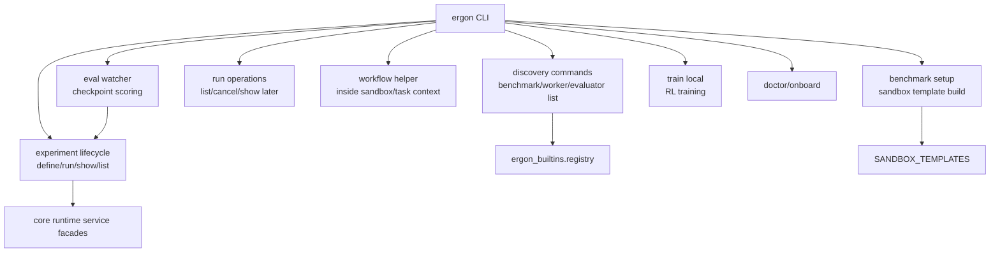
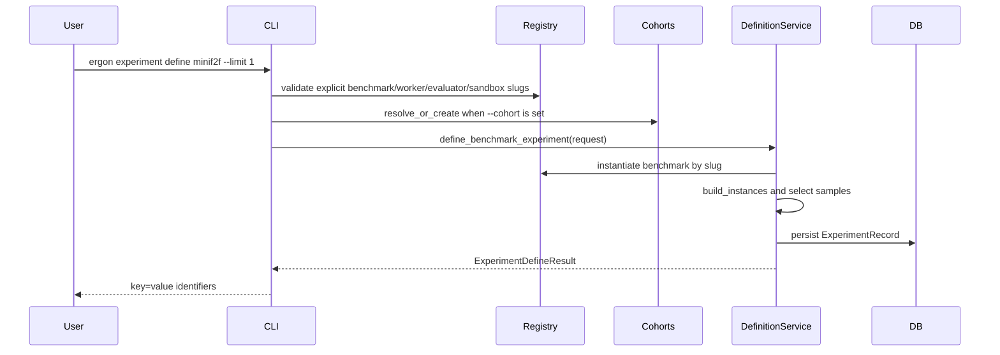

# Ergon CLI Refactor Structure

This document specifies the target CLI structure after the Ergon core public API and `ergon_builtins` package refactors. It is a sibling to:

- `2026-04-28-public-api-target-structure.md`
- `2026-04-28-ergon-builtins-rebuild-structure.md`

The CLI should become the operator-facing shell over core service facades. It should not assemble low-level graph objects by hand, import benchmark internals, or maintain a second experiment launch path that can drift from the API and runtime.

## Goals

- Make `ergon experiment define` and `ergon experiment run` the canonical local lifecycle commands.
- Make API routes, CLI commands, and eval automation call the same core services with the same DTOs.
- Make `benchmark run`, if kept, a thin wrapper over define plus run.
- Use `ergon_builtins.registry` for discovery and validation, but require explicit worker/evaluator/sandbox/model/extras choices in benchmark requests for now.
- Remove stale direct composition paths from the CLI.
- Keep operational commands such as `benchmark setup`, `workflow`, `run list`, `run cancel`, `doctor`, `onboard`, and `train` clearly separated from experiment definition and launch.
- Ensure CLI output remains machine-readable enough for tests, shell scripts, and eval automation.

## Current Shape

```text
ergon_cli/
   ergon_cli/
      main.py
         # top-level argparse parser and dispatch

      commands/
         benchmark.py
            # list, setup, stale run path
         experiment.py
            # define, run, show, list
         run.py
            # list, cancel
         worker.py
            # list
         evaluator.py
            # list
         workflow.py
            # sandbox/workflow helper commands
         eval.py
            # checkpoint eval watcher
         train.py
            # local RL training
         onboard.py
         doctor.py

      composition/
         __init__.py
            # stale direct Experiment composition helper

      discovery/
         __init__.py
            # list BENCHMARKS/WORKERS/EVALUATORS

      rendering/
         __init__.py
```

The current parser registers:

- `benchmark list`
- `benchmark setup`
- `experiment define`
- `experiment run`
- `experiment show`
- `experiment list`
- `run list`
- `run cancel`
- `worker list`
- `evaluator list`
- `workflow ...`
- `eval watch`
- `eval checkpoint`
- `onboard`
- `doctor`
- `train local`

There is handler code for `benchmark run`, but `main.py` does not register a `benchmark run` subparser. This is intentional in at least one current unit test, but conflicts with dead handler code, old setup messages, and real-LLM tests that still invoke `ergon benchmark run`.

## Target Command Model



### Canonical Lifecycle Commands

These commands define the supported local experiment lifecycle:

```text
ergon experiment define <benchmark_slug> [selection] --worker ... --evaluator ... --sandbox ... --model ... --extras ...
ergon experiment run <experiment_id> [runtime options]
ergon experiment show <experiment_id>
ergon experiment list
```

The HTTP API should remain parallel to this command set:

```text
POST /api/experiments/define
POST /api/experiments/{id}/run
GET  /api/experiments/{id}
GET  /api/experiments
```

The CLI and HTTP API should use the same service layer:

- `ExperimentDefinitionService.define_benchmark_experiment`
- `ExperimentLaunchService.run_experiment`
- `ExperimentReadService.get_experiment`
- `ExperimentReadService.list_experiments`
- `ExperimentCohortService.resolve_or_create`
- run read/cancel services

### Wrapper Commands

`ergon benchmark run` has two acceptable end states:

1. Preferred: reintroduce it as a convenience wrapper over `experiment define` plus `experiment run`.
2. Strict: delete the handler and update all docs/tests to use `ergon experiment define` plus `ergon experiment run`.

The preferred end state is to keep it as a wrapper because it is useful for demos and real-LLM canaries:

```text
ergon benchmark run minif2f --limit 1

equivalent to:
   ergon experiment define minif2f --limit 1 --worker minif2f-react --model openai:gpt-4o --evaluator minif2f-rubric --sandbox minif2f --extras none
   ergon experiment run <experiment_id>
```

The wrapper must not call `ergon_cli.composition.build_experiment` or create `RunRecord` rows itself.

### Operational Commands

These commands should stay outside the experiment lifecycle:

- `ergon benchmark setup <slug>`: build/register E2B sandbox templates.
- `ergon workflow ...`: task-local workflow/resource helper used inside workers and sandboxes.
- `ergon run list`: operator telemetry over recent runs.
- `ergon run cancel <run_id>`: cancellation and cleanup request.
- `ergon eval watch` and `ergon eval checkpoint`: checkpoint evaluation automation.
- `ergon train local`: local training integration.
- `ergon doctor` and `ergon onboard`: environment setup and diagnostics.

## Target Package Tree

```text
ergon_cli/
   ergon_cli/
      main.py
         # argparse only; no business logic

      commands/
         benchmark.py
            # list, setup, wrapper run only
         experiment.py
            # define, run, show, list through facade helpers
         run.py
            # list, cancel through run services
         worker.py
         evaluator.py
         workflow.py
         eval.py
         train.py
         onboard.py
         doctor.py

      services/
         experiment_cli_facade.py
            # CLI-specific orchestration over core service DTOs
            # parse args -> requests -> logging/rendering
         benchmark_cli_facade.py
            # benchmark list/setup/wrapper helpers
         run_cli_facade.py
            # list/cancel/show helpers

      discovery/
         __init__.py
            # registry reads only

      rendering/
         __init__.py
            # tables, key=value output, errors

      parsing/
         __init__.py
            # optional shared parser helper functions if main.py grows too large
```

`ergon_cli.composition` should be removed once `benchmark run` and smoke-only composition paths are replaced by service facade calls or test harness APIs.

## Service Boundary

The CLI may import:

```python
from ergon_builtins.registry import (
    BENCHMARKS,
    WORKERS,
    EVALUATORS,
    SANDBOX_MANAGERS,
    SANDBOX_TEMPLATES,
)

from ergon_core.core.runtime.services.experiment_definition_service import ExperimentDefinitionService
from ergon_core.core.runtime.services.experiment_launch_service import ExperimentLaunchService
from ergon_core.core.runtime.services.experiment_read_service import ExperimentReadService
from ergon_core.core.runtime.services.experiment_schemas import ExperimentDefineRequest, ExperimentRunRequest
from ergon_core.core.runtime.services.cohort_service import experiment_cohort_service
from ergon_core.core.runtime.services.run_service import cancel_run
```

The CLI should not import:

- `ergon_core.core.composition.Experiment` except inside a temporary migration shim.
- `ergon_core.core.composition.WorkerSpec` except inside core services.
- benchmark package internals such as `ergon_builtins.benchmarks.minif2f.*`.
- concrete criterion classes.
- persistence model classes for command logic, except through a temporary run-list shim.
- Inngest event classes for experiment launch, except through core services.

## Discovery Commands

### `ergon benchmark list`

Use `BENCHMARKS` plus the related worker/evaluator/sandbox registries for validation. Do not show or infer benchmark defaults in this phase.

Target columns:

```text
Slug
Name
Description
Requires Data Extra
Known Sandboxes
```

Rules:

- Include all registered benchmark slugs.
- Do not display default workers or evaluators.
- Show dependency hints only when they come from `BenchmarkRequirements` or explicit registry metadata.
- A contract test should fail if CLI code starts deriving hidden worker/evaluator/sandbox defaults.

### `ergon worker list`

Use `WORKERS`.

Target columns:

```text
Slug
Name
Kind
Description
```

`Kind` can initially be inferred:

- `class`
- `factory`

Long term, worker metadata can move into an explicit descriptor object if the registry grows.

### `ergon evaluator list`

Use `EVALUATORS`.

Target columns:

```text
Slug
Name
Kind
Description
```

`Kind` can be:

- `rubric`
- `evaluator`

If `Evaluator` remains advanced public API, list it as an advanced evaluator, not a beginner rubric.

## Experiment Define

### Command

```text
ergon experiment define <benchmark_slug>
   (--limit N | --sample-id SAMPLE_ID ...)
   [--name NAME]
   [--cohort COHORT_NAME]
   --worker WORKER_SLUG
   --model MODEL_TARGET
   --evaluator EVALUATOR_SLUG
   --sandbox SANDBOX_SLUG
   --extras EXTRAS_SPEC
   [--workflow single]
   [--max-questions N]
```

The CLI should keep these choices compulsory while the package structure is stabilizing. A benchmark slug alone is not enough information to define an experiment.

### Data Flow



### Request Mapping

```python
ExperimentDefineRequest(
    benchmark_slug=args.benchmark_slug,
    name=args.name,
    cohort_id=cohort_id,
    limit=args.limit,
    sample_ids=args.sample_id or None,
    default_model_target=args.model,
    default_worker_team={"primary": args.worker},
    default_evaluator_slug=args.evaluator,
    metadata={
        "workflow": args.workflow,
        "max_questions": args.max_questions,
        "sandbox_slug": args.sandbox,
        "extras": args.extras,
        "cli_command": "experiment define",
    },
)
```

### Output Contract

The command should print stable key/value lines:

```text
EXPERIMENT_ID=<uuid>
COHORT_ID=<uuid>        # only when known
BENCHMARK=<slug>
SAMPLES=<comma-separated sample ids>
DEFAULT_WORKER=<slug>
DEFAULT_EVALUATOR=<slug>
DEFAULT_MODEL=<model target>
```

Tests and automation should parse these lines rather than human prose.

## Experiment Run

### Command

```text
ergon experiment run <experiment_id>
   [--timeout SECONDS]
   [--no-wait]
```

### Required Core Behavior

`ExperimentLaunchService.run_experiment` should own:

1. read `ExperimentRecord`
2. create one `RunAssignment` per selected sample
3. construct a single-sample benchmark wrapper
4. instantiate evaluator binding from `EVALUATORS`
5. call `Experiment.from_single_worker(...)`
6. persist workflow definition through `ExperimentPersistenceService`
7. create `RunRecord` with:
   - `experiment_id`
   - `workflow_definition_id`
   - `instance_key`
   - `worker_team_json`
   - `evaluator_slug`
   - `model_target`
   - optional assignment/seed metadata
8. emit `WorkflowStartedEvent`

The CLI should not implement any of those steps directly.

### Wait Semantics

The current schema includes `timeout_seconds` and `wait`, but the launch service does not fully use them. The target semantics:

- `wait=True`: return after all created runs reach terminal status or timeout.
- `wait=False`: return immediately after workflow start events are emitted.
- `timeout_seconds`: maximum wait time when `wait=True`.
- Timeout should not cancel the run by default; it should return a non-zero CLI code only for the waiting command.

The result DTO should carry enough status for output:

```text
EXPERIMENT_ID=<uuid>
RUN_ID=<uuid>
RUN_STATUS=<status>     # when wait=True and known
```

If multiple runs are launched, print one `RUN_ID=` and `RUN_STATUS=` pair per run, or a tabular block after the stable key/value lines.

## Experiment Show/List

`experiment show` should read `ExperimentReadService.get_experiment`.

Output should include:

```text
EXPERIMENT_ID=<uuid>
COHORT_ID=<uuid>
NAME=<name>
BENCHMARK=<slug>
STATUS=<status>
SAMPLE_COUNT=<n>
RUN_COUNT=<n>
DEFAULT_WORKER=<slug>
DEFAULT_EVALUATOR=<slug>
DEFAULT_MODEL=<model>
SAMPLE_SELECTION=<json or comma-separated ids>
```

If runs exist, print:

```text
RUNS
<run_id>\t<instance_key>\t<status>\t<model_target>
```

`experiment list` should remain a summary table. It should not instantiate benchmarks or workers.

## Benchmark Setup

`ergon benchmark setup <slug>` remains separate from experiment lifecycle.

It should:

1. read `SANDBOX_TEMPLATES`
2. validate `E2B_API_KEY`
3. load the benchmark template spec
4. build the E2B template
5. write `~/.ergon/sandbox_templates.json` or `ERGON_CONFIG_DIR/sandbox_templates.json`
6. print a follow-up command using the canonical lifecycle

The success message should not suggest stale `benchmark run` syntax unless `benchmark run` is formally kept.

Preferred success message:

```text
Success! Template ID: <template_id>
Next:
  ergon experiment define <slug> --limit 1
  ergon experiment run <experiment_id>
```

If `benchmark run` is kept:

```text
Or:
  ergon benchmark run <slug> --limit 1
```

## Benchmark Run Wrapper

If kept, `benchmark run` should be registered in `main.py` and call a wrapper function that does exactly:

1. require the same explicit worker/evaluator/sandbox/model/extras arguments as `experiment define`
2. validate those explicit choices against registries
3. call the same define facade as `experiment define`
4. call the same run facade as `experiment run`
5. print the same stable key/value output

Target command:

```text
ergon benchmark run <benchmark_slug>
   [--limit N | --sample-id SAMPLE_ID ...]
   [--name NAME]
   [--cohort COHORT_NAME]
   --worker WORKER_SLUG
   --model MODEL_TARGET
   --evaluator EVALUATOR_SLUG
   --sandbox SANDBOX_SLUG
   --extras EXTRAS_SPEC
   [--workflow single]
   [--timeout SECONDS]
   [--no-wait]
```

The handler should not call:

- `build_experiment`
- `Experiment.persist`
- `create_run` directly
- `inngest_client.send` directly

## Run Commands

### `ergon run list`

The current CLI queries `RunRecord` directly. Target state:

- add a read method in core, either in `RunReadService` or a small `RunListService`
- support `--limit`
- support `--status`
- optionally support `--experiment-id` and `--cohort-id` later

Output columns:

```text
RUN_ID
STATUS
EXPERIMENT_ID
WORKFLOW_DEFINITION_ID
INSTANCE_KEY
MODEL
CREATED_AT
UPDATED_AT
```

### `ergon run cancel <run_id>`

Keep routed through `run_service.cancel_run`.

Target behavior:

- return `0` if cancellation request is accepted
- return non-zero if run is missing or already terminal and cannot be canceled
- print stable key/value output:

```text
RUN_ID=<uuid>
STATUS=cancelled
```

## Workflow Command

`ergon workflow` is an internal worker/sandbox helper surface, not an operator experiment lifecycle surface.

It may continue to call `WorkflowService` directly because it is already scoped by:

- `--run-id`
- `--node-id`
- `--execution-id`
- `--sandbox-task-key`
- `--benchmark-type`

Refactor rules:

- keep it isolated from benchmark definition and launch code
- do not make it import benchmark package internals
- keep `--benchmark-type` as a slug used by sandbox materialization
- add tests that workflow parser changes do not affect experiment parser behavior

## Eval Commands

`ergon eval watch` and `ergon eval checkpoint` should use the canonical experiment lifecycle for local evaluation.

Current target:

```text
eval checkpoint
   -> evaluate_checkpoint
   -> local eval path
   -> ergon experiment define
   -> ergon experiment run
   -> read run/evaluation results
```

Required cleanup:

- make `--eval-limit` required for local eval if `_run_local_eval` requires it, or provide a safe default
- ensure subprocess calls use `experiment define/run`, not `benchmark run`
- ensure output parsing relies on stable `EXPERIMENT_ID=` and `RUN_ID=` lines

## Train Command

`ergon train local` belongs to training infrastructure and should remain separate from CLI experiment lifecycle.

It may accept:

- `--benchmark`
- `--evaluator`
- `--definition-id`
- model/training parameters

The refactor should not change training semantics unless import paths break.

## Doctor And Onboard

`doctor` and `onboard` should use explicit CLI request fields plus benchmark requirements to report missing dependencies.

Examples:

- benchmark requires `[data]`
- benchmark requires E2B
- benchmark recommends `EXA_API_KEY`
- benchmark requires sandbox template setup
- model backend requires environment keys

They should not instantiate benchmark datasets just to list requirements.

## Migration Plan

### Phase 1: Parser And Command Contract

- Decide final `benchmark run` behavior.
- If keeping it, register the parser and implement it as a wrapper.
- If removing it, delete handler code and update tests/docs/real-LLM canaries.
- Update `benchmark setup` success messaging.
- Add parser tests for all command surfaces.

### Phase 2: Explicit Registry Validation

- Update `discovery.list_benchmarks()` to display registered benchmarks without implying default pairings.
- Keep `--worker`, `--model`, `--evaluator`, `--sandbox`, and `--extras` required for `experiment define` and `benchmark run`.
- Add validation errors for missing or unknown explicit choices:
  - unknown benchmark slug
  - unknown worker slug
  - unknown evaluator slug
  - unknown sandbox slug
  - missing model target
  - missing extras/dependency intent

### Phase 3: CLI Facade Extraction

- Create `ergon_cli/services/experiment_cli_facade.py`.
- Move argument-to-DTO mapping out of command handlers.
- Keep `commands/experiment.py` thin.
- Add `benchmark_cli_facade.py` for list/setup/wrapper run.
- Add `run_cli_facade.py` for list/cancel once run read service exists.

### Phase 4: Delete Direct Composition Path

- Remove `ergon_cli.composition.build_experiment` from production CLI flows.
- Move any smoke-only composition behavior into core test harness or test support.
- Ensure no production CLI command imports `Experiment`, `WorkerSpec`, or Inngest events for launch.

### Phase 5: Wait/Poll Semantics

- Implement service-level `wait` and `timeout_seconds`, or remove those fields from CLI/schema.
- Prefer implementing them because e2e and demos need blocking behavior.
- Add tests for:
  - `--no-wait` returns after dispatch
  - timeout returns non-zero without canceling runs
  - completed runs return status lines

### Phase 6: Run Read Service

- Add a service method for listing recent runs.
- Route `run list` through it.
- Keep `run cancel` through `cancel_run`.
- Add tests for status filtering.

## Test Plan

### Unit Tests

Parser tests:

- `benchmark list` parses
- `benchmark setup <slug>` parses
- `benchmark run <slug>` parses if kept, fails if removed
- `experiment define` parses only with explicit worker/model/evaluator/sandbox/extras
- `experiment run --no-wait` parses
- `run list --status failed` parses
- `eval checkpoint --eval-limit 1` parses

Facade tests:

- define facade builds `ExperimentDefineRequest` with explicit CLI choices
- define facade rejects missing explicit worker/evaluator/sandbox/model/extras
- define facade resolves cohort only when `--cohort` is provided
- run facade builds `ExperimentRunRequest`
- benchmark wrapper calls define then run facades
- benchmark wrapper does not import or call direct composition helpers

Discovery tests:

- benchmark list does not imply default worker/evaluator pairings
- worker list includes factory entries
- evaluator list includes rubric/evaluator entries
- discovery does not expose hidden benchmark defaults

### Integration Tests

Service/CLI integration tests should cover:

- `experiment define` persists `ExperimentRecord` with slugs and sample selection
- `experiment run` creates `RunRecord` rows with required foreign keys and assignment JSON
- `benchmark run` wrapper produces the same database shape as define plus run
- `run list` reads persisted runs through service
- `run cancel` emits cancellation and cleanup events

### E2E Tests

E2E should keep using:

```text
ergon experiment define
ergon experiment run
```

unless `benchmark run` is explicitly retained as a wrapper, in which case one small canary can prove the wrapper path.

The full e2e matrix is specified in `2026-04-28-ergon-e2e-refactor-test-plan.md`.

## Known Drifts To Resolve

1. `benchmark run` exists in `commands/benchmark.py` but is not registered in `main.py`.
2. `commands/benchmark.py::_create_and_dispatch` calls `create_run` with an old signature.
3. `experiment run --timeout` and `--no-wait` are represented in DTOs but not fully honored by the launch service.
4. `ergon_cli.composition` imports stale public API modules for `Experiment` and `WorkerSpec`.
5. `run list` queries persistence directly instead of using a core read service.
6. `eval checkpoint` can reach local eval without an `eval_limit` even though the local eval helper requires one.
7. `benchmark setup` still prints stale `benchmark run` guidance.

## Final CLI Contract

The refactor is complete when:

- all experiment lifecycle commands go through core service facades
- all discovery commands read registries
- no production CLI command constructs `Experiment` directly
- no production CLI command creates `RunRecord` directly for launch
- `benchmark run` is either a tested wrapper or fully removed
- API, CLI, e2e, and eval automation agree on the same define/run semantics
- stable key/value CLI output is covered by tests
