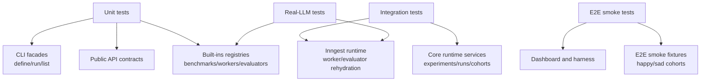
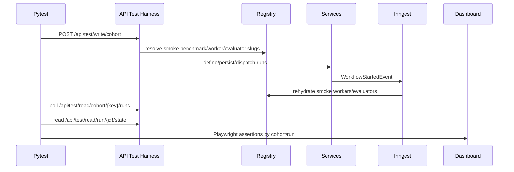

# Ergon E2E Refactor Test Plan

This document specifies the test strategy that should accompany the Ergon core, built-ins, and CLI refactor. It is a sibling to:

- `2026-04-28-public-api-target-structure.md`
- `2026-04-28-ergon-builtins-rebuild-structure.md`
- `2026-04-28-ergon-cli-refactor-structure.md`

The purpose is to keep the refactor self-consistent: public API objects, built-in registry slugs, CLI commands, runtime rehydration, smoke fixtures, e2e harnesses, and dashboard assertions should all prove the same contract.

## Goals

- Preserve the existing four-tier testing model: unit, integration, e2e smoke, real-LLM.
- Keep production built-ins separate from test-only smoke fixtures.
- Use e2e smoke to prove cross-process behavior, not pure benchmark logic.
- Ensure CLI define/run behavior is covered by unit and integration tests before e2e uses it.
- Ensure every production benchmark family has contract tests for registry shape and explicit CLI pairing documentation.
- Ensure runtime execution can rehydrate workers, rubrics, criteria, task payloads, and sandbox managers from persisted slugs.
- Keep dashboard and harness checks aligned with run/cohort semantics.

## Testing Tier Model

The source of truth should remain path-based:

```text
tests/unit/
   pure logic, models, validators, registry shape, parser behavior

tests/integration/
   real Postgres and real Inngest dev server; service, persistence, API boundaries

tests/e2e/
   full stack, test harness, real E2B, dashboard, Playwright

tests/real_llm/
   opt-in or nightly; real model calls and budget-gated canaries
```

Markers are developer ergonomics, not the canonical tier definition. If `pyproject.toml` marker descriptions conflict with `docs/architecture/07_testing.md`, update the marker descriptions to match the path-based model.

## High-Level Coverage Map



## Fixture Residency Rules

## Stable E2E Boundary After Core Layout Refactor

Core behavior is stable, but private repository and persistence modules may move.
E2E code should use only:

- HTTP endpoints under `/api/test/*`
- `ergon_core.test_support`
- public core API objects from `ergon_core.api`
- application read-model facades, not private repository methods

The existing smoke behavior assertions remain valid:

- happy runs complete the 12-node graph
- sad runs fail `l_2` and block `l_3`
- happy runs produce 20 task resources and 26 context events
- happy root produces two score-1.0 evaluations
- sad runs produce one partial artifact and seven completion messages

### Production Built-ins

Production benchmark code belongs under:

```text
ergon_builtins/ergon_builtins/
```

Production built-ins include:

- benchmark loaders
- production task payload schemas
- production worker factories
- production criteria and rubrics
- production sandbox managers
- production registry entries
- shared production worker/model/tool helpers

Production built-ins must not import:

- `ergon_core.test_support`
- `tests`
- smoke fixture workers
- smoke fixture criteria
- smoke benchmark loaders

### Core Test Support

Canonical smoke fixtures belong under:

```text
ergon_core/ergon_core/test_support/smoke_fixtures/
```

This package owns:

- smoke benchmark replacements for `researchrubrics`, `minif2f`, and `swebench-verified`
- smoke workers
- smoke leaf workers
- recursive smoke workers
- sad-path workers
- smoke criteria and smoke rubrics
- `SmokeSandboxManager`
- registry mutation hook `register_smoke_fixtures()`

Smoke fixtures register into `ergon_builtins.registry` only when explicitly enabled by:

- `ERGON_STARTUP_PLUGINS=ergon_core.test_support.smoke_fixtures:register_smoke_fixtures`
- `ENABLE_TEST_HARNESS=1`
- `ENABLE_SMOKE_FIXTURES=1` for any remaining host-side transitional paths

### Tests

Test drivers and assertions belong under:

```text
tests/
```

They own:

- unit parser tests
- registry and explicit pairing contract tests
- integration service tests
- e2e cohort submission
- e2e harness polling
- dashboard Playwright orchestration
- real-LLM canaries

Tests can import `ergon_core.test_support` in unit/integration contexts. Black-box e2e client code should not register fixtures in the host process; fixture registration should happen inside the API process through startup plugins.

## Current Smoke Fixture Shape

```text
ergon_core/ergon_core/test_support/
   __init__.py
      # register_smoke_fixtures public hook

   smoke_fixtures/
      __init__.py
         # mutates WORKERS, EVALUATORS, and optionally BENCHMARKS/SANDBOX_MANAGERS

      benchmarks.py
         # ResearchRubricsSmokeBenchmark
         # MiniF2FSmokeBenchmark
         # SweBenchSmokeBenchmark

      sandbox.py
         # SmokeSandboxManager

      criteria/
         minif2f_smoke.py
         researchrubrics_smoke.py
         swebench_smoke.py
         smoke_rubrics.py
         timing.py

      smoke_base/
         worker_base.py
         leaf_base.py
         recursive.py
         sadpath.py
         criterion_base.py
         subworker.py
         constants.py

      workers/
         minif2f_smoke.py
         researchrubrics_smoke.py
         researchrubrics_smoke_sadpath.py
         swebench_smoke.py
```

The smoke benchmarks deliberately reuse production benchmark slugs:

```text
researchrubrics
minif2f
swebench-verified
```

They replace production benchmark loaders only when `ENABLE_TEST_HARNESS=1`, so e2e does not need HuggingFace, production data, or LLM access to materialize root tasks.

## Canonical Smoke Program

Every PR should continue to run three e2e legs:

```text
researchrubrics
minif2f
swebench-verified
```

Each leg submits a cohort with:

- one happy-path run
- one sad-path run

The topology should stay identical across benchmark slugs:

```text
Diamond:
      d_root
     /      \
 d_left    d_right
     \      /
      d_join

Line:
   l_1 -> l_2 -> l_3

Singletons:
   s_a
   s_b
```

Happy-path `l_2` routes to a recursive worker with nested children:

```text
l_2
└─ l_2_a -> l_2_b
```

Sad-path `l_2` routes to a failing leaf. `l_3` must remain blocked or cancelled according to the static-sibling failure semantics decision.

## E2E Submission Flow



The black-box e2e tests should not:

- import production internals
- call `build_experiment`
- call `create_run`
- send Inngest events directly
- register smoke fixtures in the host pytest process

The API process owns fixture registration through `ERGON_STARTUP_PLUGINS`.

## CLI Coverage Flow

CLI tests should be split by tier:

```text
unit:
   parser and facade DTO mapping

integration:
   experiment define/run persistence and dispatch semantics

e2e:
   one small black-box CLI canary only if needed
```

The canonical e2e smoke path should use the HTTP test harness, not the CLI, because it is primarily proving cross-process runtime, sandbox, dashboard, and cohort behavior. CLI define/run gets its own unit and integration coverage.

If `benchmark run` is kept as a wrapper, add exactly one CLI e2e canary proving wrapper wiring. Do not duplicate the full smoke matrix through both HTTP harness and CLI.

## Unit Test Plan

### Public API Contract Tests

Add or update tests under:

```text
tests/unit/architecture/
tests/unit/api/
```

Required assertions:

- `ergon_core.api` exports beginner public symbols:
  - `Benchmark`
  - `Task`
  - `EmptyTaskPayload`
  - `BenchmarkRequirements`
  - `Worker`
  - `WorkerContext`
  - `WorkerOutput`
  - `Criterion`
  - `CriterionContext`
  - `CriterionOutcome`
  - `ScoreScale`
  - `CriterionEvidence`
  - `EvidenceMessage`
  - `Rubric`
  - `TaskEvaluationResult`
  - `CriterionCheckError`
- moved core composition types are not root-public authoring concepts:
  - `Experiment`
  - `WorkerSpec`
  - `DefinitionHandle`
- public API modules do not import DB/session modules.
- public worker code does not import context event repositories for default output extraction.

### Built-ins Registry And Pairing Tests

Add or update tests under:

```text
tests/unit/registry/
tests/unit/builtins/
tests/unit/benchmarks/
tests/unit/state/
```

Required assertions:

- every `BENCHMARKS` key equals the benchmark class `type_slug`
- every benchmark exposes `task_payload_model`
- every benchmark exposes `BenchmarkRequirements`
- every documented CLI pairing references registered benchmark, worker, evaluator, and sandbox slugs
- no production code derives hidden worker/evaluator/sandbox defaults from a benchmark slug
- importing `registry_core.py` does not require `[data]` dependencies
- importing `registry_data.py` is allowed to require optional data extras
- production registries do not include smoke worker slugs
- smoke fixture registration is idempotent
- smoke fixture registration only overrides benchmark loaders when `ENABLE_TEST_HARNESS=1`

### CLI Unit Tests

Add or update tests under:

```text
tests/unit/cli/
```

Required assertions:

- parser registers all canonical commands
- parser outcome for `benchmark run` matches the decision in the CLI spec
- `experiment define` requires explicit `--worker`, `--model`, `--evaluator`, `--sandbox`, and `--extras`
- missing explicit worker/model/evaluator/sandbox/extras values fail before service calls
- define facade builds `ExperimentDefineRequest`
- run facade builds `ExperimentRunRequest`
- benchmark wrapper calls define plus run facades if kept
- `benchmark setup` success guidance uses canonical commands
- discovery output does not imply hidden benchmark defaults
- `run list` delegates to run read service after that service exists
- `eval checkpoint` handles missing or default `--eval-limit` consistently

### Smoke Fixture Unit Tests

Keep and extend tests under:

```text
tests/unit/smoke_base/
```

Required assertions:

- topology constants remain the single source of truth
- `SmokeWorkerBase.execute` remains final
- every environment has:
  - happy parent worker
  - leaf worker
  - recursive worker
  - sad-path parent
  - failing leaf
  - smoke rubric
- all smoke workers accept the current public `Worker` constructor contract
- smoke criteria use the public `CriterionContext` capability surface
- smoke benchmark payload schemas match production payload shape enough for runtime serialization
- e2e driver pairs exist for every smoke environment

### Architecture Boundary Tests

Keep and extend:

```text
tests/unit/architecture/test_no_test_logic_in_core.py
tests/unit/architecture/test_smoke_fixture_package_boundary.py
```

Target assertions:

- production core does not import `ergon_core.test_support` except explicit test harness/plugin loading points
- `ergon_builtins` does not import `ergon_core.test_support`
- `ergon_builtins` does not import `tests`
- `ergon_cli` production commands do not import smoke fixture modules
- API startup plugin loader may import configured plugins dynamically
- `/api/test/*` is mounted only when `ENABLE_TEST_HARNESS=1`

## Integration Test Plan

Integration tests use real Postgres and real Inngest dev server. They should not require real LLM calls.

### Experiment Services

Add or update tests under:

```text
tests/integration/
tests/unit/runtime/
```

Required scenarios:

1. Define experiment from a smoke benchmark slug.
2. Persist selected sample keys and explicit worker/evaluator/sandbox/model/extras choices.
3. Run experiment and create one `RunRecord` per selected sample.
4. Persist workflow definition with benchmark, worker, and evaluator slugs.
5. Emit `WorkflowStartedEvent` for each run.
6. Support `wait=False` path.
7. Support timeout path without deleting or cancelling the run.

### Runtime Rehydration

Required scenarios:

- worker execution rehydrates worker factory from `WORKERS`
- worker execution validates task payload through registered benchmark payload model
- evaluator execution rehydrates evaluator from `EVALUATORS`
- criteria run against `CriterionContext`, not direct concrete runtime imports in public modules
- sandbox manager is resolved from `SANDBOX_MANAGERS`
- sandbox setup completes before benchmark-owned worker factories are invoked
- failed worker path persists partial artifacts and marks downstream dependencies correctly

### Sandbox Integration

Keep benchmark-specific sandbox manager tests:

```text
tests/integration/minif2f/test_sandbox_manager.py
tests/integration/researchrubrics/test_sandbox_manager.py
tests/integration/swebench_verified/test_sandbox_manager.py
tests/integration/sandbox/test_required_env_keys.py
```

Refactor expectations:

- these tests should import benchmark sandbox managers from final package locations
- they should not depend on CLI composition helpers
- they should be skipped or marked clearly when E2B credentials are absent, according to current integration policy

### Evaluator Integration

Keep and align:

```text
tests/integration/minif2f/test_verification_integration.py
tests/integration/swebench_verified/test_criterion.py
tests/integration/swebench_verified/test_rubric.py
```

Required updates:

- import renamed public result/context classes
- assert `CriterionOutcome` evidence fields where appropriate
- avoid old `EvaluationContext` naming
- ensure SWE-Bench criterion patch extraction uses `CriterionContext` capabilities

## E2E Smoke Test Plan

### Python E2E Layout

Target layout:

```text
tests/e2e/
   conftest.py
      # infra preflight, shared DB session, optional CLI helper

   _submit.py
      # black-box cohort submission through /api/test/write/cohort

   _asserts.py
      # run graph, resources, evaluation, communication, sandbox assertions

   _read_contracts.py
      # DTO helpers for /api/test/read endpoints

   test_researchrubrics_smoke.py
   test_minif2f_smoke.py
   test_swebench_smoke.py
```

Each `test_<env>_smoke.py` should:

1. build a cohort key
2. submit two slots:
   - happy smoke worker plus smoke rubric
   - sad-path smoke worker plus smoke rubric
3. wait for terminal statuses
4. assert happy run graph/resources/evaluations/messages
5. assert sad run partial artifacts and blocked/cancelled downstream node
6. run the dashboard Playwright smoke spec for that environment

### Required Per-Run Assertions

Happy run assertions:

- root node completed
- expected direct child nodes exist
- nested `l_2_a` and `l_2_b` exist
- dependency edges match canonical topology
- all expected leaf/dynamic nodes completed
- `GenerationTurn` count matches expected topology
- communication thread messages exist in order
- run resources include outputs and probe artifacts
- blob store round-trip works
- root evaluations exist
- evaluation timestamps are after root execution completion
- sandbox health probe succeeded

Sad run assertions:

- root node reaches failed or terminal failed-equivalent state
- `l_2` failed
- `l_3` blocked or cancelled until the failure semantics RFC pins final status
- partial artifact from failing leaf exists
- pre-failure sandbox WAL entry exists when WAL persistence exists
- no successful final evaluation score is recorded
- unaffected branches completed as expected

### Dashboard Assertions

Dashboard e2e specs under:

```text
ergon-dashboard/tests/e2e/
```

should assert:

- cohort page renders both happy and sad runs
- run status is visible
- graph canvas renders
- each expected task node appears by `data-testid`
- environment label appears
- failed/blocked node states are visible on sad path
- evaluation panel shows root evaluation where expected
- resources/artifacts are visible where expected

Backend harness DTOs should remain the source of truth for data-rich assertions; Playwright should assert that the UI represents the same state.

## Real-LLM Test Plan

Real-LLM tests are opt-in and should not block ordinary local development.

Target directory:

```text
tests/real_llm/
   benchmarks/
      test_researchrubrics.py
      test_minif2f.py        # optional future canary
      test_swebench.py       # optional future canary
      test_smoke_stub.py
   fixtures/
      stack.py
      harness_client.py
      playwright_client.py
      openrouter_budget.py
```

Required canaries:

- one no-LLM stub model canary proving CLI wrapper behavior if `benchmark run` is kept
- one ResearchRubrics real model run proving report generation and LLM judge path

Optional canaries:

- MiniF2F real model proof attempt
- SWE-Bench real model patch attempt

Real-LLM tests should use strict budgets and explicit environment gates:

- `ERGON_REAL_LLM=1`
- OpenRouter/OpenAI/Anthropic keys as required
- stack readiness fixtures

## Test Harness Contract

The `/api/test/*` harness should remain test-only.

Mounting rules:

- enabled only when `ENABLE_TEST_HARNESS=1`
- write endpoints require `X-Test-Secret` or configured secret behavior
- read endpoints are safe for Playwright and pytest polling in test environments

Required endpoints:

```text
POST /api/test/write/cohort
GET  /api/test/read/cohort/{cohort_key}/runs
GET  /api/test/read/run/{run_id}/state
```

The write endpoint should use the same core services as production experiment launch. It may use smoke fixture registry entries, but it should not keep a separate run creation path that bypasses service invariants.

## Coverage Matrix

| Area | Unit | Integration | E2E Smoke | Real-LLM |
|---|---|---|---|---|
| Public API exports | required | no | no | no |
| Public API import boundaries | required | no | no | no |
| Built-ins registry and explicit pairing shape | required | optional | indirect | optional |
| Benchmark `build_instances` contract | required with stubs | data-dependent paths | smoke replacements | real datasets optional |
| CLI parser/facade mapping | required | optional | one canary only | optional |
| Experiment define/run services | fast mocked unit plus contract tests | required | indirect through harness | indirect |
| Run creation schema | required | required | indirect | indirect |
| Inngest worker rehydration | required | required | required | required for canaries |
| Evaluator/criterion rehydration | required | required | required | required for judge canaries |
| Sandbox manager setup | unit stubs | required per benchmark | required smoke path | optional |
| Dashboard event contracts | required | optional | required | optional |
| Cohort happy/sad behavior | unit topology | service-level partial | required | optional |
| LLM generation quality | no | no | no | required |

## Migration Plan

### Phase 1: Freeze Test Boundaries

- Update this plan and `docs/architecture/07_testing.md` if necessary.
- Align `pyproject.toml` marker descriptions with the path-based tier model.
- Add boundary tests proving production built-ins do not import smoke/test modules.
- Add tests proving smoke fixtures register only through explicit hooks.

### Phase 2: Public API Rename Tests

- Update unit tests to use final public names:
  - `Task`
  - `BenchmarkRequirements`
  - `CriterionContext`
  - `CriterionOutcome`
  - `ScoreScale`
  - `CriterionEvidence`
  - `EvidenceMessage`
- Keep no compatibility alias tests unless the product decision changes.

### Phase 3: Built-ins Registry And Pairing Tests

- Add explicit pairing contract tests for:
  - `minif2f`
  - `swebench-verified`
  - `gdpeval`
  - `researchrubrics`
  - `researchrubrics-vanilla`
- Add optional dependency import tests for `registry_core.py` versus `registry_data.py`.

### Phase 4: CLI Contract Tests

- Update parser tests around the final `benchmark run` decision.
- Add facade tests for define/run DTO mapping.
- Add integration tests for `experiment define` and `experiment run`.
- Update real-LLM tests to use canonical CLI commands or the wrapper if retained.

### Phase 5: Runtime Rehydration Tests

- Update Inngest worker execution tests for final `Task` payload paths.
- Update evaluator execution tests for final `CriterionContext` and `CriterionOutcome`.
- Add regression tests for sandbox setup before worker factory invocation.
- Add tests for persisted slugs matching registry keys.

### Phase 6: E2E Harness Alignment

- Ensure `/api/test/write/cohort` calls the same core launch service path as CLI/API.
- Ensure e2e host process does not register fixtures.
- Ensure API process registers fixtures by startup plugin.
- Ensure smoke benchmark replacements override production benchmark loaders only when `ENABLE_TEST_HARNESS=1`.
- Keep Playwright specs aligned with expected smoke topology constants.

### Phase 7: Dashboard And Artifact Assertions

- Turn soft-skipped sandbox WAL assertions into hard assertions once WAL persistence exists.
- Keep screenshots on failure.
- Verify dashboard `data-testid` attributes remain stable:
  - `run-status`
  - `task-node-{slug}`
  - `graph-canvas`
  - `cohort-run-row`
  - `cohort-env-label`

## Required Test Files To Update Or Add

### Unit

```text
tests/unit/architecture/test_public_api_shape.py
tests/unit/architecture/test_no_test_logic_in_core.py
tests/unit/architecture/test_smoke_fixture_package_boundary.py
tests/unit/registry/test_builtin_pairings.py
tests/unit/registry/test_react_factories.py
tests/unit/cli/test_experiment_cli.py
tests/unit/cli/test_benchmark_setup.py
tests/unit/cli/test_eval_cli_required_fields.py
tests/unit/smoke_base/test_smoke_fixture_registration.py
tests/unit/smoke_base/test_e2e_smoke_driver_pairs.py
```

### Integration

```text
tests/integration/smokes/test_smoke_harness.py
tests/integration/minif2f/test_verification_integration.py
tests/integration/minif2f/test_sandbox_manager.py
tests/integration/researchrubrics/test_sandbox_manager.py
tests/integration/swebench_verified/test_criterion.py
tests/integration/swebench_verified/test_rubric.py
tests/integration/swebench_verified/test_sandbox_manager.py
tests/integration/sandbox/test_required_env_keys.py
```

Add, if missing:

```text
tests/integration/cli/test_experiment_define_run.py
tests/integration/runtime/test_registry_rehydration.py
tests/integration/runtime/test_experiment_launch_service_wait.py
```

### E2E

```text
tests/e2e/conftest.py
tests/e2e/_submit.py
tests/e2e/_asserts.py
tests/e2e/_read_contracts.py
tests/e2e/test_researchrubrics_smoke.py
tests/e2e/test_minif2f_smoke.py
tests/e2e/test_swebench_smoke.py
```

### Dashboard

```text
ergon-dashboard/tests/e2e/_shared/smoke.ts
ergon-dashboard/tests/e2e/researchrubrics.smoke.spec.ts
ergon-dashboard/tests/e2e/minif2f.smoke.spec.ts
ergon-dashboard/tests/e2e/swebench-verified.smoke.spec.ts
ergon-dashboard/tests/helpers/backendHarnessClient.ts
```

### Real-LLM

```text
tests/real_llm/benchmarks/test_researchrubrics.py
tests/real_llm/benchmarks/test_smoke_stub.py
tests/real_llm/fixtures/stack.py
tests/real_llm/fixtures/harness_client.py
tests/real_llm/fixtures/openrouter_budget.py
```

## Acceptance Criteria

The refactor is test-complete when:

- unit tests prove public API exports and import boundaries
- unit tests prove built-ins registry and explicit pairing consistency
- unit tests prove CLI parser/facade behavior
- integration tests prove experiment define/run services persist the expected records
- integration tests prove runtime worker/evaluator rehydration from slugs
- e2e tests pass for `researchrubrics`, `minif2f`, and `swebench-verified`
- e2e host process remains a black-box client
- smoke fixtures stay out of production built-ins
- real-LLM tests are updated to the final CLI contract
- dashboard Playwright specs still render and assert cohort/run state

## 2026-04-29 Finish Plan Update

The current execution plan for completing the built-ins, CLI, and e2e refactor is:

```text
docs/superpowers/plans/2026-04-29-finish-builtins-cli-e2e-refactor.md
```

That plan supersedes this document's older migration checklist where the two disagree. In particular:

- `benchmark run` is retained as an explicit `experiment define` plus `experiment run` wrapper.
- E2E smoke submissions must pass explicit `worker`, `evaluator`, `sandbox`, `model`, and `extras` choices through the test harness.
- E2E host-side tests may import `ergon_core.test_support`, public API modules, HTTP `/api/test/*`, and stable application read models, but not private core repository or persistence internals.
- The existing smoke runtime assertions remain hard assertions: happy runs still expect 12 tasks, 10 leaves, 20 resources, 26 context events, 2 root evaluations, and 11 completion messages; sad runs still expect `l_2` failed, `l_3` blocked, one partial artifact, and 7 completion messages.
- Any persistence-level data still needed for e2e assertions should be exposed through `ergon_core.test_support` helpers rather than imported directly by `tests/e2e`.

## Open Decisions

1. Whether e2e should include one CLI subprocess canary in addition to HTTP harness submission.
2. Whether sandbox command WAL persistence lands during this refactor or remains a follow-up.
3. Whether `tests/integration/swebench_verified/test_smoke_e2e.py` should be renamed because it is not a full e2e test.
