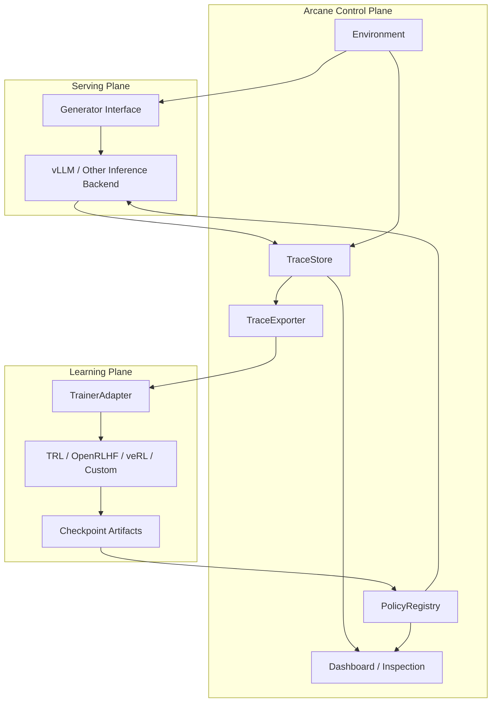

# Async RL Library Implementation Review

This document summarizes a code-level review of several open-source async RL and post-training stacks and turns that review into concrete recommendations for Arcane.

This is a companion to `design/async_rl/async_rl_architecture_discussion.md`.

The difference is intentional:

- `async_rl_architecture_discussion.md` is the higher-level architecture thesis
- this document is implementation-grounded and focused on design decisions

## Why This Document Exists

The most important open question is not "which RL library should Arcane use?"

The real question is:

- what data model should Arcane own?
- which contracts should Arcane make explicit?
- which parts should remain framework-agnostic?
- what implementation patterns from existing async RL stacks are worth copying?
- which patterns look useful in a blog post but become footguns in code?

To answer that, the following libraries were cloned locally and inspected at the code level:

- `verl`
- `prime-rl`
- `PipelineRL`
- `SkyRL`
- `AReaL`
- `open-instruct`
- `OpenRLHF`
- `trl`

The review focused on:

- rollout buffering units
- policy versioning and staleness control
- parameter synchronization behavior
- environment, generator, and trainer interfaces
- persisted versus transient state
- operational footguns

## Executive Summary

The implementation review strongly reinforces the earlier architecture direction.

The main conclusion is:

Arcane should not model the world primarily as `actions`.

Arcane should model the world as:

- immutable `policy_versions`
- lossless `trace_events`
- typed `rollout_episodes`
- schedulable `rollout_groups`
- derived `training_exports`

The codebases that felt the most robust all make some version of the following choices:

- the buffered unit between generation and training is a typed rollout artifact, not a UI-friendly action row
- every rollout is tied to a policy version, either explicitly or implicitly
- staleness is bounded operationally, and the strongest systems make it explicit in the data path
- weight sync is treated as a first-class protocol, not an incidental side effect
- transient queue state is separated from canonical long-term trajectory storage

The codebases that felt weaker usually had one or more of these properties:

- policy freshness was implicit instead of explicit
- "too old" data was counted but still trained on
- queue depth was used as a proxy for correctness
- model version semantics were overloaded or inconsistently defined

## What The Libraries Actually Do

### 1. The buffered unit is almost never an "action"

Across the reviewed systems, the unit passed between rollout generation and learning is something like:

- a trajectory batch
- a sample group
- a micro-batch
- a replay entry
- a turn/sequence tensor package

Examples:

- `verl` uses `DataProto` and `RolloutSample`
- `prime-rl` uses `TrainingBatch` and `MicroBatch`
- `trl` async GRPO uses `RolloutSample`
- `AReaL` uses trajectory dicts with token, mask, logprob, and version tensors
- `OpenRLHF` uses `Experience`

This matters a lot for Arcane.

If Arcane stores only:

- tool name
- tool args
- text output
- maybe some reasoning blob

then Arcane is storing a debug view, not the training reality.

### 2. Explicit policy versioning is the dividing line between clean and messy systems

The strongest implementations explicitly represent freshness:

- `trl` async GRPO tags each sample with `model_version` and drops stale samples
- `verl` propagates `global_steps` and computes trajectory parameter versions
- `prime-rl` tracks `ckpt_step`, `async_level`, and `max_off_policy_steps`
- `SkyRL` tracks `global_step_when_scheduled` and computes current staleness
- `AReaL` goes furthest by carrying token-span version information in generated outputs

The weaker implementations are the ones where freshness is mostly inferred from queue topology or loop timing.

That is operationally convenient, but architecturally weak.

### 3. "Fully async" usually still pauses somewhere

In practice, even highly async systems often pause or partially drain around weight updates.

Patterns observed:

- explicit pause/resume around inference generation
- stop flags during weight broadcast
- checkpoint-ready barriers
- bounded in-flight lag rather than unconstrained overlap

This is important because "no pauses ever" sounds attractive, but introduces a large surface area for:

- torn reads of weights
- mixed-version batches
- duplicate or wasted generation
- unclear semantics for correctness and attribution

### 4. Strong systems separate canonical state from operational state

Common split:

- relational metadata and auditability in a database
- checkpoints and large artifacts in filesystem or object storage
- hot-path coordination in queues or in-memory transports

This matches the earlier Arcane direction:

- Postgres for canonical experiment and trace state
- Redis or equivalent for queues and leases
- artifact storage for checkpoints and large payloads

## Architecture Lessons Per Library

### `AReaL`

Most relevant lesson:

- token-span-level provenance is worth taking seriously

Why it matters:

- `ModelResponse` carries `input_tokens`, `output_tokens`, `output_logprobs`, and `output_versions`
- workflow code constructs tensors that preserve version metadata across the generated span

Takeaway for Arcane:

- if the long-term goal is post-training on exact generated behavior, the trace model should be capable of preserving span- and token-level metadata, even if the first product surface remains turn-level

### `verl`

Most relevant lesson:

- async systems benefit from an explicit interchange object and explicit staleness accounting

Why it matters:

- `DataProto` provides a stable training-facing unit
- the fully async path tracks sample staleness and parameter version metadata

Takeaway for Arcane:

- Arcane should define its own canonical export/interchange schema instead of leaking internal DB tables directly into trainer integrations

### `trl`

Most relevant lesson:

- simple, hard stale-drop policies are easier to reason about than clever heuristics

Why it matters:

- async GRPO carries `model_version`
- samples beyond `max_staleness` are dropped

Takeaway for Arcane:

- start with a hard freshness contract before attempting more advanced off-policy correction behavior

### `prime-rl`

Most relevant lesson:

- separating orchestration from training creates a useful control plane boundary

Why it matters:

- checkpoint version is explicit
- async lag is a visible control variable
- rollout scheduling and learning are decoupled as separate concerns

Takeaway for Arcane:

- Arcane should think of itself as the environment/orchestration control plane, not the trainer implementation

### `SkyRL`

Most relevant lesson:

- staleness budgets need both queue sizing and semantic attribution

Why it matters:

- completed generations are buffered
- scheduling step and consumption step are compared

Takeaway for Arcane:

- both queue capacity and sample version metadata matter; either one alone is insufficient

### `open-instruct`

Most relevant lesson:

- async data preparation and active generation pipelines are practical, but version contracts can remain too implicit

Why it matters:

- the system uses `async_steps` and bounded prepared data
- weight sync correctness depends on stop flags and careful orchestration

Takeaway for Arcane:

- operational overlap is useful, but should sit underneath a stronger data model than "whatever was in flight at the time"

### `OpenRLHF`

Most relevant lesson:

- queue-based async rollout and training can be simple, but queue depth alone is not a sufficient correctness model

Why it matters:

- `async_queue_size` bounds off-policy lag operationally
- there is not the same first-class trajectory versioning that stronger stacks expose

Takeaway for Arcane:

- use queue depth for throughput control, not as the primary semantics for policy provenance

### `PipelineRL`

Most relevant lesson:

- soft lag accounting is not enough

Why it matters:

- the code tracks lag and version-ish metadata
- but still counts too-old samples instead of clearly rejecting them

Takeaway for Arcane:

- do not let "we can measure staleness" substitute for "we know what to do with stale data"

## Concrete Design Decisions For Arcane

The review suggests the following decisions should be made early and made explicitly.

## Decision 1: The canonical persisted unit should be `trace_events`, not `actions`

Arcane should replace the current lossy action-centric mental model with a trace-centric one.

At minimum, the canonical trace model should be able to represent:

- observation assembled for one policy turn
- model request envelope
- streamed deltas, if available
- final model response
- tool call arguments
- tool call returns
- environment transition outputs
- reward assignments
- terminal outcome

The events should be append-only and time-ordered.

Why:

- this matches how training systems actually consume data
- it preserves debuggability without sacrificing fidelity
- it avoids prematurely flattening rich multimodal or structured outputs into a narrow action schema

## Decision 2: Arcane should store both turn-level and token/span-level views

The right default product abstraction is still turn-level.

That means:

- runs
- rollout groups
- rollout episodes
- turns
- rewards

But the storage model must be able to preserve finer-grained generation structure when available:

- token spans
- per-span provenance
- optional logprobs
- optional per-token version or generation metadata

The correct compromise is:

- make turn-level objects the primary product and UI abstraction
- make token/span payloads optional but first-class in storage and export

Why:

- pure token-as-action is too low-level for most of the runtime
- pure turn-level storage is too lossy for post-training and async RL correctness

## Decision 3: `policy_version` must be immutable and first-class

Arcane should define a first-class `policy_version` entity with immutable metadata.

Fields should include at least:

- `id`
- `policy_id`
- `version_index`
- `base_model_name`
- `adapter_type`
- `checkpoint_uri`
- `tokenizer_uri` or tokenizer hash
- generation settings snapshot
- trainer metadata
- created_at
- parent_version_id

Every rollout episode and every model-generated span should point back to a `policy_version`.

Why:

- async RL becomes ambiguous immediately without this
- export pipelines need to know which policy produced which data
- debugging model regressions requires immutable lineage

## Decision 4: Staleness should be a hard policy, not a dashboard metric

Arcane should define an explicit stale-data policy for training exports and queue consumption.

Recommended initial rule:

- if `current_policy_version - sample_policy_version > max_staleness`, the sample is excluded from training export

Recommended initial implementation:

- compute freshness at export time and queue consumption time
- keep the raw trace for audit/debug
- mark the sample as stale and excluded
- do not silently train on it

Why:

- this matches the clearest designs from `trl` and the stronger parts of `verl`
- it is much easier to relax a hard contract later than to recover trust after training on semantically ambiguous data

## Decision 5: Arcane should own the environment contract, not the trainer math

Arcane should define narrow, durable interfaces for:

- `Environment`
- `Generator`
- `PolicyRegistry`
- `TraceStore`
- `TraceExporter`
- `TrainerAdapter`

Arcane should not attempt to embed PPO, GRPO, DAPO, or similar algorithm logic as a core responsibility.

Why:

- the reviewed libraries differ heavily in trainer internals
- the stable boundary is the orchestration, trace, and export layer
- this keeps Arcane compatible with multiple trainer stacks

## Decision 6: Arcane should separate canonical state from hot-path queue state

Recommended split:

### Postgres

Canonical metadata and indexable system state:

- runs
- rollout groups
- rollout episodes
- turns
- trace events
- reward events
- policy versions
- trainer jobs
- export manifests

### Redis or equivalent

Hot-path operational state:

- rollout queue
- training-export-ready queue
- leases
- worker heartbeats
- active policy pointer cache

### Artifact storage

Large immutable payloads:

- checkpoints
- adapters
- tokenizer artifacts
- oversized trace blobs
- exported training shards

Why:

- this matches how the stronger systems separate durable truth from operational throughput

## Decision 7: Weight sync should begin as drain-or-pause, not fully in-flight

Recommended initial design:

- rollout workers may finish current work
- new generation is paused or withheld during weight sync
- once the new policy version is registered and visible, rollout resumes

Only after this is stable should Arcane explore more aggressive in-flight update models.

Why:

- almost every codebase reviewed pays a complexity tax here
- the pause/drain model is easier to reason about
- correctness matters more than squeezing out the last few percent of throughput in the first implementation

## Decision 8: Arcane should export framework-neutral training views

Arcane should not expose raw table dumps to trainers.

Instead, Arcane should produce versioned export manifests and training shards with a stable schema.

Examples:

- sequence-level export for TRL-like trainers
- grouped rollout export for veRL-like or OpenRLHF-like pipelines
- environment replay export for future custom trainers

Why:

- each framework expects a different internal batch shape
- the stable asset should be the export manifest, not the exact internal DB layout

## Recommended Interface Contracts

These are the most important interfaces to make explicit.

### `Environment`

Responsibilities:

- accept a policy turn
- execute tools or benchmark logic
- produce the next observation
- emit rewards and terminal signals

Suggested shape:

```python
class Environment(Protocol):
    async def reset(self, episode_input: EpisodeInput) -> Observation: ...
    async def step(self, action: PolicyTurn) -> TransitionResult: ...
```

### `Generator`

Responsibilities:

- accept an observation or formatted model request
- generate a policy turn
- optionally stream deltas
- return generation metadata

Suggested shape:

```python
class Generator(Protocol):
    async def generate(self, request: GenerationRequest) -> GenerationResult: ...
```

### `PolicyRegistry`

Responsibilities:

- register immutable policy versions
- resolve the active version for rollout
- expose artifact pointers and tokenizer identity

Suggested shape:

```python
class PolicyRegistry(Protocol):
    async def register(self, artifact: PolicyArtifact) -> PolicyVersion: ...
    async def get_active(self, policy_id: str) -> PolicyVersion: ...
```

### `TraceStore`

Responsibilities:

- append trace events
- materialize episode and turn views
- support replay, inspection, and export

Suggested shape:

```python
class TraceStore(Protocol):
    async def append_events(self, events: list[TraceEvent]) -> None: ...
    async def finalize_episode(self, episode_id: str, result: EpisodeResult) -> None: ...
```

### `TraceExporter`

Responsibilities:

- select eligible rollouts
- enforce freshness policy
- build framework-neutral manifests and shards

Suggested shape:

```python
class TraceExporter(Protocol):
    async def export(self, request: ExportRequest) -> ExportManifest: ...
```

### `TrainerAdapter`

Responsibilities:

- submit training jobs to a specific backend
- monitor job status
- surface resulting checkpoint artifacts back into the policy registry

Suggested shape:

```python
class TrainerAdapter(Protocol):
    async def launch(self, manifest: ExportManifest, config: TrainerConfig) -> TrainerJob: ...
    async def poll(self, job_id: str) -> TrainerJobStatus: ...
```

## Proposed Data Model

Arcane does not need every table on day one, but the architecture should point in this direction.

### Core entities

- `policy_versions`
- `rollout_groups`
- `rollout_episodes`
- `rollout_turns`
- `trace_events`
- `reward_events`
- `training_exports`
- `training_export_items`
- `trainer_jobs`

### `trace_events`

Representative event kinds:

- `observation_materialized`
- `model_request_started`
- `model_delta`
- `model_response_completed`
- `tool_call_started`
- `tool_call_completed`
- `environment_transition`
- `reward_emitted`
- `episode_terminated`

Each event should carry:

- stable ids
- parent entity ids
- timestamps
- sequence ordering
- event kind discriminator
- structured payload
- optional artifact pointers
- `policy_version_id` when applicable

### `rollout_turns`

Turn rows should exist as a query-friendly materialization over the event stream.

Fields should include:

- `episode_id`
- `turn_index`
- `policy_version_id`
- `observation_event_range`
- `generation_event_range`
- `reward_summary`
- `terminal`

This keeps the UI and analytics layer fast without making `rollout_turns` the only source of truth.

## What Can Be Cleared And When

The reviewed libraries were useful here because they make a strong distinction between canonical data and ephemeral throughput state.

Recommended Arcane policy:

### Safe to clear aggressively

- rollout queue items once acknowledged into an export buffer or persisted episode state
- in-memory or Redis leases
- transient streaming deltas if fully folded into a persisted final event stream
- temporary packed batches produced for one trainer backend

### Should not be cleared early

- canonical trace events
- policy version metadata
- reward events
- export manifests
- trainer job lineage

### Can be compacted but not destroyed

- token-level spans older than a retention threshold, if lossless raw payloads are safely archived in object storage
- derived product/UI materializations, because they can be rebuilt from canonical traces

## Footguns To Avoid

These patterns appeared often enough in the reviewed code to justify writing them down explicitly.

### 1. Using queue depth as a substitute for provenance

Queue depth is useful for throughput control.

It is not enough to answer:

- which policy produced this sample?
- how stale was it?
- should it be trained on?

### 2. Counting stale samples but still consuming them

This produces dashboards that look honest while keeping semantics ambiguous.

Arcane should prefer hard include/exclude rules.

### 3. Overloading "version"

Different codebases use:

- optimizer step
- checkpoint index
- broadcast counter
- sample count

as "version."

Arcane should keep these separate:

- `policy_version`
- `trainer_step`
- `export_sequence`
- `rollout_schedule_step`

### 4. Making UI materializations the source of truth

The easiest way to kill future training flexibility is to persist only the data shape the UI currently likes.

The UI should read from derived views over canonical traces, not define the canonical schema.

### 5. Going all-in on token-level control flow too early

Token-level provenance is valuable.

But the environment and product boundary should still be turn-level first.

Arcane should preserve fine-grained generation data without making every runtime path operate at token granularity.

## Recommended System Flow

The following flow tries to preserve both high-performance training and framework flexibility.

```mermaid
flowchart LR
    A[Task / Benchmark Input] --> B[Arcane Environment]
    B --> C[Observation Builder]
    C --> D[Generator Interface]
    D --> E[Inference Service / Active Policy Version]
    E --> F[Generation Result]
    F --> G[TraceStore Append Events]
    G --> H[Environment Step / Tool Execution]
    H --> I{Episode Done?}
    I -- No --> C
    I -- Yes --> J[Reward Events + Episode Finalization]
    J --> K[Eligibility / Freshness Filter]
    K --> L[TraceExporter]
    L --> M[Framework-Neutral Export Manifest]
    M --> N[TrainerAdapter]
    N --> O[External Trainer]
    O --> P[Checkpoint / Adapter Artifact]
    P --> Q[PolicyRegistry Register Version]
    Q --> R[Active Policy Pointer]
    R --> E
```



## System Map By Plane



## Staged Recommendation

The review suggests a fairly clear implementation order.

### Stage 1

- introduce `policy_versions`
- introduce canonical `trace_events`
- materialize `rollout_turns` from trace events
- preserve exact request/response payloads for every model turn

### Stage 2

- add `training_exports` and freshness gating
- define framework-neutral export schemas
- support at least one external trainer integration

### Stage 3

- add transient rollout queue and learner scheduling controls
- add async policy update lifecycle and active-policy switching
- add stale-sample observability and drop policies

### Stage 4

- add token/span-level archival or object-storage offload
- add more advanced off-policy correction or partial-rollout handling if needed

## Final Recommendation

If Arcane wants to become an async RL and post-training system without getting trapped inside one trainer stack, it should make the following core bet:

Arcane owns:

- the environment runtime
- the trace and reward store
- the policy registry
- the export/control plane

External frameworks own:

- optimization logic
- batching internals
- parallel training mechanics
- algorithm-specific math

That division of responsibility is the pattern that best survives contact with the implementations that were reviewed.
